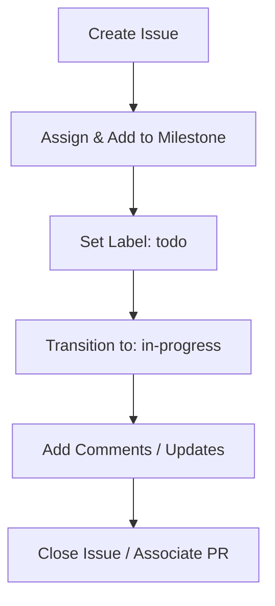

# GitHub Issues Tracking & Management Guide for AI Dev Agents

To maintain high project velocity, clean documentation, and clear visibility on milestones, this project relies on GitHub Issues as the single source of truth for planning, execution, and tracking. 

AI agents working on this project must strictly follow this guide.

---

## 1. Core Principles
1. **No Unplanned Work**: Every task, bug fix, feature, refactoring, or design change must have a corresponding GitHub Issue before code modifications begin.
2. **Real-time Status Updates**: GitHub Issues must reflect the exact current status of the task. If a task starts, progresses, gets blocked, or is completed, the issue must be updated immediately.
3. **Traceability**: All pull requests, commits, and implementation plans must reference the issue number (e.g., `#123`).

---

## 2. Issue Lifecycle & Workflow

Every feature or bug must go through the following lifecycle:



### Phase 1: Planning (Creation & Triage)
Before writing code or proposing implementation plans:
* **Check for Existing Issues**: Ensure a duplicate issue does not exist.
* **Create a New Issue**: If it does not exist, create it with a clear, concise title and structured description.
* **Labels**: Assign one or more appropriate labels from the exact set of labels that exist on our GitHub repository:
  * `bug` (for bug fixes)
  * `documentation` (for docs updates)
  * `enhancement` (for new features or improvements)
  * `v0` (for initial project tracking)
  * `duplicate`, `good first issue`, `help wanted`, `question`, `wontfix` (other standard labels)
  > [!IMPORTANT]
  > Do not use arbitrary labels like `feature` or `refactor` unless they are explicitly created on GitHub first, as GitHub will reject the requests if the label does not exist.
* **Milestones**: Always assign the issue to the active Milestone (e.g., `v1.0-MVP`, `Sprint-1`).
* **Assignee**: Assign the issue to yourself (the active AI Agent).

### Phase 2: Execution (In-Progress)
When beginning work on an issue:
* **Update the Status**: Update the issue status label to `in-progress`.
* **Post a Comment**: Comment on the issue stating that you are beginning implementation. If you have an approved implementation plan, paste a brief summary or reference it.
* **Update on Blocks/Changes**: If you encounter a blocking issue or require a design pivot, update the issue description or leave a comment immediately.

### Phase 3: Completion (Resolution)
When the task is complete and verified:
* **Close the Issue**: Close the issue.
* **Reference PRs/Commits**: Provide a closing comment referencing the specific commits or Pull Request numbers that resolved the issue (e.g., "Resolved in #12").
* **Cleanup Labels**: Remove the `in-progress` label and ensure the final state is documented.

---

## 3. GitHub Issue Templates

### Feature Request Template
* **Title**: `[Feature]: Short Descriptive Title`
* **Description**:
  ```markdown
  ### Description
  A clear and concise description of what the feature is.
  
  ### User Stories / Requirements
  - [ ] Requirement 1
  - [ ] Requirement 2
  
  ### Proposed Implementation Plan
  - Brief bullet points of proposed architecture or changes.
  ```

### Bug Report Template
* **Title**: `[Bug]: Short Descriptive Title`
* **Description**:
  ```markdown
  ### Describe the Bug
  A clear and concise description of what the bug is.
  
  ### Steps to Reproduce
  1. Go to '...'
  2. Click on '...'
  3. See error
  
  ### Expected Behavior
  A clear and concise description of what you expected to happen.
  
  ### Screenshots/Logs
  Paste logs or attach screenshots if applicable.
  ```

---

## 4. MCP Tools Reference for Agents
You must use the following `github-mcp-server` tools to manage this workflow:
* **Creation**: `create_issue` or `issue_write` (to open issues).
* **Updates**: `add_issue_comment` (to provide progress updates or blockages).
* **Lifecycle changes**: `update_issue` (to change status labels, assignees, or close the issue).
