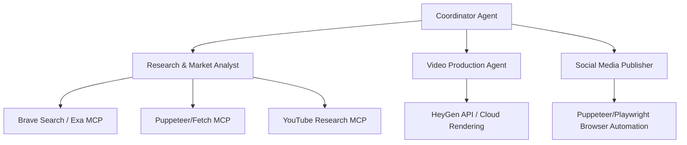

# Implementation Plan: Making Jarvis an Automated Video Machine

This plan details the design and architecture required to empower Jarvis to perform autonomous research on niche subjects, execute market and competitive analysis, generate videos using high-quality Cloud AI video APIs, and publish videos automatically using browser automation.

---

## Technical Choices Selected

### 1. Upload Method: Browser Automation (Option B)
- **Approach**: We will use browser automation (Puppeteer or Playwright via Python/JS) to open a browser session, authenticate to your YouTube, Instagram, and TikTok accounts, and programmatically click and upload the rendered videos.
- **Why**: Avoids strict developer review requirements and API limitations from Meta and ByteDance.

### 2. Video Generation Method: Cloud AI API (Option B)
- **Approach**: Integrate with the **HeyGen v3 API** (or equivalent like Synthesia/JSON2Video) to generate premium quality videos using digital avatars and high-quality voiceover.
- **Approximate Pricing**:
  - **Pay-as-you-go model** (No monthly subscription required for the API; operates on a prepaid USD wallet).
  - **Avatar Level III** (Studio/Digital Twin): ~$1.00 per minute of generated video ($0.0167/sec).
  - **Avatar Level IV/V** (Premium Digital Twin): ~$3.00 - $4.00 per minute of generated video ($0.05 - $0.0667/sec).
  - *Example monthly budget*: If generating 10 videos (1 minute each) per month:
    - Standard quality: ~$10.00 / month
    - Premium twin quality: ~$30.00 to $40.00 / month

---

## Proposed System Architecture

---

## Proposed Changes

### 1. Research & Analysis Module

#### [NEW] [research_agent.py](file:///d:/Charalambos/Desktop/AI/second-brain-voice/agents/research_agent.py)
A specialized agent module to conduct research on specific niches or subniches.
- Uses search APIs or web scraping to read articles, blogs, and news feeds.
- Analyzes competitor websites, forums (Reddit, Quora), and trending topics.
- Saves summarized insights and research papers as markdown notes in the database.

#### [NEW] [youtube_research.py](file:///d:/Charalambos/Desktop/AI/second-brain-voice/agents/youtube_research.py)
A utility to analyze viral videos in a niche.
- Queries YouTube search API or scrapes YouTube for top-performing videos in the target subniche.
- Retrieves video metadata (view count, engagement rates, tags, descriptions).
- Fetches and summarizes transcripts of viral videos to extract successful hooks, structure, and script ideas.

### 2. Scripting & Video Production Module

#### [NEW] [video_generator.py](file:///d:/Charalambos/Desktop/AI/second-brain-voice/agents/video_generator.py)
A module to compile scripts and render videos.
- **Script Generation**: Uses Gemini to convert market research into engaging scripts (including hooks, visual cues, and narration).
- **HeyGen API Connector**: Submits the script and configuration (avatar choice, voice, resolution) to HeyGen, polls for completion, and downloads the output `.mp4`.

### 3. Social Media Distribution Module

#### [NEW] [social_publisher.py](file:///d:/Charalambos/Desktop/AI/second-brain-voice/connectors/social_publisher.py)
A browser automation publisher using Playwright/Puppeteer.
- Implements direct UI uploads to YouTube Studio, Instagram Reels Creator, and TikTok Web Upload.
- Manages persistent browser profiles/session cookies so you remain logged in and avoid prompt checks.

### 4. Integration & Database Updates

#### [MODIFY] [coordinator.py](file:///d:/Charalambos/Desktop/AI/second-brain-voice/coordinator.py)
Register new tool definitions for the coordinator:
- `research_niche(subject, depth)`
- `analyze_competitor_videos(niche_query)`
- `generate_video(script_outline, target_platform)`
- `publish_video(video_id, platforms)`

#### [MODIFY] [requirements.txt](file:///d:/Charalambos/Desktop/AI/second-brain-voice/requirements.txt)
Add Python packages:
- `playwright` or `puppeteer-client`
- `requests` (for HeyGen API calls)
- `youtube-transcript-api` (Transcript analysis)

---

## Required Model Context Protocol (MCP) Servers

To expand Jarvis's capabilities using the Claude Desktop/Cursor runtime, we recommend setting up the following MCP servers in your environment:

1. **Brave Search MCP (`brave-search`)**:
   - **Purpose**: Allows Jarvis to fetch real-time search results, news, and market information for niche analysis.
2. **Fetch MCP (`fetch` or `puppeteer`)**:
   - **Purpose**: Enables reading the full HTML text or markdown conversion of articles, blogs, and competitor websites.
3. **Puppeteer MCP (`puppeteer`)**:
   - **Purpose**: Essential for browser automation to upload files directly to social platforms.
4. **YouTube MCP (`youtube`)**:
   - **Purpose**: Search for videos, fetch details, and extract transcripts.

---

## Verification Plan

### Automated Tests
- Script tests to verify API endpoints:
  `python -m unittest tests/test_research.py`
  `python -m unittest tests/test_video_gen.py`

### Manual Verification
1. Run local script generation using research data and check the script quality.
2. Generate a short 10-second test video using the HeyGen API to verify API connection.
3. Perform a test automated upload of a test video to private/unlisted visibility.
