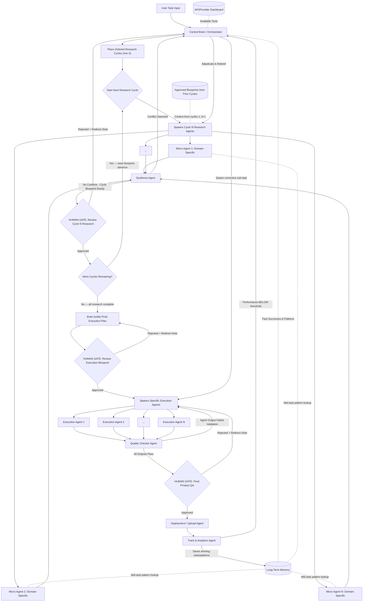

# Implementation Plan: Universal Autonomous Multi-Agent Architecture (Jarvis)

This document outlines the core operational architecture for Jarvis. It is designed to handle **any complex task** (marketing, coding, content creation, research) through a dynamic, multi-agent orchestration process.

## 1. Goal Description
To build a closed-loop, autonomous system where a Central Brain delegates tasks to highly specialized, dynamically spawned micro-agents. The system features **ordered, multi-cycle research** (each cycle covers a different domain — e.g., branding → video production → virality — and each cycle has its own synthesis + approval gate), strict Human-in-the-Loop (HITL) approval gates with **rejection re-routing**, a conflict-resolving Synthesis Agent, a Quality Checker Agent, bidirectional Long-Term Memory, and a closed-loop performance feedback system. The Brain and agents dynamically decide how many research cycles are needed (minimum 3), with each cycle building on the approved outputs of the previous ones.

---

## 2. Technical Safeguards

> [!TIP]
> **Modifications Added to the Core Script:**
>
> 1. **The Synthesis Mechanism:** If you spawn 12 research agents, they will return massive amounts of data. Passing all that raw data directly to the Execution Agents will overwhelm their context window. **Modification:** Added a `Synthesis Agent` right before Gate 1. It compresses the 12 reports into one hyper-dense blueprint. **⚠️ CRITICAL: "Compress" means an LLM reads ALL agent reports and produces a unified blueprint incorporating the best insights from each. It does NOT mean flattening dicts and picking the first value per key — that silently discards all but one agent's work.**
> 2. **API Fallback Loop:** APIs break or hit rate limits. **Modification:** If a specialized agent hits an error (e.g., YouTube API is down), it doesn't crash the system. It signals the Brain, which instantly reads the Dashboard and assigns a backup API (e.g., Supadata) to finish the job.
> 3. **[FIX #2] Gate Rejection Re-routing:** All three HITL Gates now have explicit rejection paths. A human "No" is never a dead end — it routes back with the rejection reason attached as context, so the Brain or Execution layer knows exactly what to correct.
> 4. **[FIX #3] Conflict Resolution in Synthesis:** The Synthesis Agent now detects contradictory findings between research agents before producing the blueprint. Conflicts are flagged and escalated back to the Brain to adjudicate, not silently discarded.
> 5. **[FIX #4] Quality Checker Agent:** After execution agents finish but before Gate 3 human review, a lightweight Quality Checker Agent validates each agent's output. Failed agents are re-spawned automatically rather than blocking the gate with bad output.
> 6. **[FIX #5] Bidirectional Long-Term Memory:** Research Agents can now query the Long-Term Memory mid-task, not just at initiation. This means a Hook Researcher can see that "punchy opening lines under 5 words historically perform 80% better" before writing, not after.
> 7. **[FIX #6] Closed-Loop Performance Feedback:** If the Track Agent detects performance below a defined threshold (e.g., video CTR < 3%), it sends a signal back to the Brain to re-initiate a corrective sub-task. The loop never ends at deployment.
> 8. **Max Retry / Loop Guard:** Configurable safeguards (`MAX_RETRIES = 3`) are applied to the conflict resolution loop, gate rejection re-routings, and Quality Checker re-runs. If retries exceed this limit, the system gracefully escalates to the user with a detailed error report containing the exact issues that caused the retries, preventing infinite loops and runaway LLM costs.
> 9. **[FIX #7] Ordered Multi-Cycle Research:** Research is NOT a single parallel blast. The Brain plans an ordered sequence of research cycles (minimum 3), where each cycle targets a specific domain (e.g., Cycle 1: brand identity & positioning, Cycle 2: content format & production, Cycle 3: distribution & virality). Each cycle spawns its own parallel agents, runs synthesis, and pauses at its own approval gate. Later cycles receive the approved blueprints from earlier cycles as input context — so the video production research already knows the brand voice, and the virality research already knows the content format. The Brain and agents decide the cycle count dynamically based on task complexity.

---

## 3. Proposed Architecture Flow (Fully Fixed)



---

## 4. Phase Breakdown

### Phase 1: The Central Brain (Orchestrator)
- **Action**: Receives the task, assesses difficulty, and determines the initial requirements.
- **[FIX #7] Cycle Planning**: The Brain's first job is to plan an **ordered sequence of research cycles** (minimum 3). Each cycle targets a distinct domain or layer of the task. The cycle plan is itself a structured JSON output from the Brain:
  ```json
  {
    "cycles": [
      {"cycle_id": 1, "domain": "Brand & Identity", "goal": "Understand company positioning, voice, and competitive landscape"},
      {"cycle_id": 2, "domain": "Content Production", "goal": "Determine optimal video format, structure, and production approach"},
      {"cycle_id": 3, "domain": "Distribution & Virality", "goal": "Research SEO, platform algorithms, hook patterns, and CTR optimization"},
      {"cycle_id": 4, "domain": "Monetization", "goal": "Research CTA placement, affiliate strategies, and conversion funnels"}
    ]
  }
  ```
- **Ordering matters**: Each cycle's agents receive the approved blueprints from ALL prior cycles as input context. The video production cycle already knows the brand voice. The virality cycle already knows the content format.
- **Provisioning**: Reads the API/Provider configuration registry (mapping services to their API keys, endpoints, and status: up/down/rate-limited) and grants the necessary tools to the agents.
- **Memory Read**: Queries Long-Term Memory for any relevant past patterns *before* spawning agents.

### Phase 2: Ordered Multi-Cycle Research [FIX #7 + FIX #8]

The research phase is a **loop** — not a single parallel blast. For each cycle in the Brain's plan:

#### 2a. Spawn Cycle Research Agents (Lead Specialist + Advisory Agents)

Each cycle has **one Lead Specialist agent** and **multiple Advisory agents**. The Lead Specialist owns the cycle's domain and has the **final word** on the cycle's output.

- **Lead Specialist**: A single agent who is deeply specialized in the current cycle's domain. This agent has authority over the final cycle blueprint. After reviewing all advisory input, the Lead decides what to keep, modify, or discard.
- **Advisory Agents**: Supporting agents that contribute research from adjacent angles. They provide opinions, data, and alternative perspectives — but the Lead Specialist is not obligated to accept their input.

**Example (Video Task)**:
  - **Cycle 1 (Brand)**:
    - 🎯 **Lead**: `Brand Strategist` — owns brand positioning, voice, and identity decisions
    - 📎 Advisory: `Competitor Analyst` — researches competitor branding for the Lead to consider
    - 📎 Advisory: `Target Audience Researcher` — profiles the ideal customer for the Lead to factor in
  - **Cycle 2 (Production)**:
    - 🎯 **Lead**: `Content Director` — owns format, structure, and production decisions
    - 📎 Advisory: `Hook Format Researcher` — researches hook patterns for the Lead to evaluate
    - 📎 Advisory: `Visual Style Researcher` — researches visual trends for the Lead to review
  - **Cycle 3 (Virality)**:
    - 🎯 **Lead**: `Growth Strategist` — owns distribution, SEO, and algorithm strategy
    - 📎 Advisory: `Platform Algorithm Researcher` — provides platform-specific data
    - 📎 Advisory: `Trend Researcher` — identifies current viral patterns

**Two-Pass Research Flow**:
  1. **Pass 1 — Parallel Research**: All agents (Lead + Advisory) run in parallel. Each produces their own findings independently.
  2. **Pass 2 — Lead Specialist Review**: The Lead Specialist receives ALL advisory agents' findings. The Lead reviews each one and produces the **authoritative cycle output** — a final JSON that incorporates, modifies, or explicitly rejects each advisory finding with a reason.

  The Lead's review prompt includes:
  ```
  You are the Lead Specialist for this research cycle. You have FINAL AUTHORITY.
  Below are findings from your advisory agents. For each advisory finding:
  - ACCEPT: incorporate it into your output (with or without modifications)
  - REJECT: explain why you are discarding it
  You must produce the definitive cycle research output.
  ```

  > **⚠️ ANTI-PATTERN WARNING:** The Lead Specialist review must NOT be a simple merge or majority vote. The Lead is a separate LLM call that reads its own initial findings PLUS all advisory findings and produces a new, authoritative output. The Lead's domain expertise means their judgment overrides advisory agents when there is disagreement — this is by design. If implemented as `{**lead_findings, **advisory_1, **advisory_2}` (dict merge), the Lead's expertise is silently overwritten by generalist advisory agents.

- **Context Injection**: Agents in Cycle N automatically receive the **approved blueprints from Cycles 1 through N-1** as part of their system prompt. This means the Content Director in Cycle 2 already knows the brand voice and target audience from Cycle 1's Lead Specialist output.
- **[FIX #5] Bidirectional Memory**: Each Research Agent (Lead and Advisory) can issue a memory query mid-task (e.g., "What hook formats worked above 70% retention?") and get back relevant patterns from past successful runs.
- **API Selection & Dynamic Tools**: Agents do NOT hardcode their tools list (e.g., in `research_agent.py`'s `tools_list`). Instead, they dynamically construct their tools list by reading the `tools_needed` provided in their configuration from the registry.
- **API Fallback Loop**: If an agent hits an API failure (e.g., rate limits or service down), it signals the Central Brain, which reads the registry status and reassigns a backup tool/connector to allow the agent to finish the task without crashing the pipeline.

#### 2b. Synthesis + Conflict Resolution (Per-Cycle) [FIX #3]
- **Input**: The Lead Specialist's authoritative cycle output (which already incorporates/rejects advisory input).
- **Compression**: The Synthesis Agent takes the Lead's final output and compresses it into a hyper-dense **cycle blueprint**, formatted for downstream consumption.
  > **⚠️ ANTI-PATTERN WARNING:** "Compress" must NOT be implemented as naive dict-merging or picking one agent's value per key. The Synthesis Agent must use a structured LLM call that reads the Lead's full output and produces a single unified blueprint. Any implementation that flattens results into `{key: entries[0]["value"]}` silently discards critical nuance.
- **[FIX #3] Conflict Detection**: Even after the Lead's review pass, the Synthesis Agent checks for internal contradictions within the Lead's output (e.g., the Lead accepted two advisory findings that contradict each other).
  - If a conflict or multiple competing options (APIs/MCPs) are detected:
    - They are formatted into a structured list of options.
    - Each option must explicitly show **"Why use it (Pros)"** and **"Why not use it (Cons)"**.
    - The signal and options route back to the Brain and are presented directly to the user at the cycle gate.
    - **User Resolution**: The user is presented with a checkbox interface where they can see the comparison and select one or *multiple* APIs/MCPs/options to be used simultaneously.
  - Conflicts are flagged with the specific contradiction described.
  - The signal routes back to the Brain, not to the gate.
  - Brain adjudicates (either resolves it or asks the Lead Specialist to re-review with the conflict highlighted).
  > **⚠️ ANTI-PATTERN WARNING:** Conflict detection must NOT compare stringified dict values across agents for matching keys. Research agents produce unique `findings` dicts with different keys — they will almost never share keys, so real semantic contradictions (e.g., Agent A says "use React" while Agent B says "React is not suitable for this use case") will be silently missed. Conflict detection must be performed by an LLM that reads all findings and identifies logical/semantic contradictions.

#### 2c. Per-Cycle Approval Gate [FIX #2 + FIX #7]
- The system pauses at a **per-cycle approval gate**. The user reviews:
  - The current cycle's domain and goal
  - The aggregated research from this cycle's agents
  - The compiled cycle blueprint
  - Any unresolved conflicts/options
  - How this cycle's findings build on prior approved cycles
- **Approved**: The cycle blueprint is saved to the `approved_blueprints` stack. The loop advances to the next cycle.
- **[FIX #2] Rejected**: The user attaches a redirect note (e.g., "Focus more on competitor SEO analysis, not just ours"). This note is passed back to the Brain as additional context. The Brain **does not restart from scratch** — it re-briefs only the relevant research agents for THIS cycle and re-synthesises.
  > **⚠️ ANTI-PATTERN WARNING:** "Re-briefs only the relevant research agents" must NOT be implemented as re-running ALL agents. The Brain must parse the redirect note to identify which specific agent(s) need re-briefing, then spawn only those. After they return, the Synthesis Agent must re-run using the mix of old (unchanged) + new (re-run) agent results — not discard the old results.

#### 2d. Cycle Completion
- When all cycles are approved, the Brain has a **stack of approved blueprints** — one per cycle. These are merged by the Synthesis Agent into a **Master Research Blueprint** that combines all cycles' findings.
- This master blueprint is what feeds into the Execution Plan.

### Phase 3: Master Blueprint Compilation
- **Action**: The Synthesis Agent takes all N approved cycle blueprints and produces one unified **Master Research Blueprint**.
- This is the document that the Execution Plan is built from. It contains the full knowledge from all research cycles.

### Phase 4: Execution Plan (Final Implementation Plan)
- **Action**: Using the master blueprint, the Brain creates the **Final Implementation Plan**.
- **Dynamic Spawning**: The system spawns execution agents based *strictly* on what the combined research dictated was necessary.

### Phase 5: HUMAN GATE — Review Execution Blueprint [FIX #2]
- **Approved**: Execution agents are spawned and begin building.
- **[FIX #2] Rejected**: The redirect note routes back to the Execution Plan stage. The Brain adjusts the blueprint (e.g., "swap out the Python backend for Node.js") without restarting research.

### Phase 6: Execution + Quality Checker [FIX #4]
- **Execution**: Spawned agents build the final product using their designated APIs.
- **[FIX #4] Quality Checker Agent**: Once all execution agents return their outputs, the Quality Checker Agent executes a **two-tiered verification**:
  1. **Individual Verification**: Runs schema checks (correct JSON keys, word count metrics) and executes a lightweight LLM call to verify that each agent's output semantically adheres to its individual brief, spec, and tone.
  2. **Global Integration Verification**: Executes a final LLM-powered check to ensure that all generated outputs align and integrate seamlessly with each other (and with any untouched components during partial re-runs).
- **Pass**: All outputs proceed to the final gate.
- **Fail**: The specific failed agent(s) are flagged and re-spawned, not the entire execution batch.

### Phase 7: HUMAN GATE — Final Product QA [FIX #2]
- **Approved**: Deployment Agent authenticates and pushes the product live.
- **[FIX #2] Rejected**: The redirect note routes back to SpawnExec. Only the specific component the user rejected needs to be rebuilt, not the entire execution batch.
  > **⚠️ ANTI-PATTERN WARNING:** "Only the specific component" must NOT be implemented as re-running `run_execution_phase()` with the full agent plan (which re-spawns ALL agents). The redirect note must be parsed (by the Brain via LLM) to identify which specific agent ID(s) produced the rejected component, then only those agents are re-spawned. The final result set must merge the re-run outputs with the previously-approved outputs.

### Phase 8: Deployment Agent
- **Action**: An `agents/deployment_agent.py` is called by the pipeline coordinator once the final gate passes.
- **Mechanism**: The agent takes the final compiled execution results + a target platform configuration, authenticates with the external API/service (YouTube, GitHub, Stripe, etc.), and performs the actual upload/deployment.
- > **⚠️ ANTI-PATTERN WARNING:** The pipeline must NOT end prematurely by simply returning a dictionary with `"ready_for_deploy": True` (as currently done in `multi_agent_coordinator.py`). The coordinator must await the actual execution of the Deployment Agent and record the deployment status/logs in the pipeline state before passing control to the Track Agent.

### Phase 9: Closed-Loop Tracking [FIX #6]
- **Action**: An active `agents/track_agent.py` runs as a background process (or cron loop) to monitor live stats post-deployment.
- **Mechanism**: The agent actively polls external APIs (such as YouTube Analytics, Google Analytics, GitHub API, etc.) for performance data rather than relying on passive REST endpoints. It reads performance targets and thresholds directly from the task/pipeline metadata.
- **[FIX #6] Memory Save (Wins)**: If performance is ABOVE threshold — extracts the *why* (e.g., "This intro hooked 80% of viewers") and saves the pattern into Long-Term Memory.
  > **⚠️ ANTI-PATTERN WARNING:** "Extracts the *why*" must NOT be a simple copy of the metric value into the `memory_patterns` table (e.g., just saving `{"pattern": "ctr was 8%"}`). The Track Agent must use an LLM call that receives the full execution blueprint + the performance data and produces an actionable insight (e.g., "Opening with a question under 5 words correlated with 80% 30-second retention"). Raw metrics without causal analysis are useless as memory patterns.
- **[FIX #6] Corrective Loop (Losses)**: If performance is BELOW a defined threshold (e.g., CTR < 3%, error rate > 5%):
  - Track Agent sends a failure signal back to the Brain.
  - Brain spawns a **corrective sub-task** (e.g., "Re-cut the hook", "Patch the failing endpoint").
  - This sub-task re-enters the pipeline at Phase 6 (Execution), bypassing the research phase.
  - The loop is genuinely closed — deployment is not the end state.

---

## 5. What You Already Have vs. What You Need to Build

### ✅ Already Built
| Component | File | Status |
|---|---|---|
| Central Brain (single-agent) | `coordinator.py` | Working — needs multi-agent upgrade |
| Tool calling (DB, search) | `coordinator.py` | Working |
| Long-Term Memory (tasks + notes) | `db.py` | Working — needs pattern storage table |
| Flask API server | `jarvis.py` | Working |
| Wake word + voice | `jarvis.py` | Working |
| Brain Interface UI | `agent_map_final.html` | Working (Three.js nebula) |
| Pipeline Coordinator UI | `jarvis_plan_preview.html` | Prototype — needs backend wiring |
| API/MCP Connectors (stubs) | `connectors/` | Stubs only — need real implementations |

### 🔧 What Needs to Be Built

**Priority 1 — Core Multi-Agent Engine + Research Cycle Loop** (`multi_agent_coordinator.py`)
- **[FIX #7] Cycle Planning**: The Brain's `build_agent_plan` now returns a `cycles` list. Each cycle has a `domain`, `goal`, and its own `research_agents` list.
- **Cycle Loop**: `run_full_pipeline` iterates through cycles sequentially. For each cycle:
  1. Spawn the cycle's research agents in parallel (using `asyncio` + Gemini/Claude calls)
  2. Run synthesis on cycle results
  3. Pause at a per-cycle approval gate
  4. On approval, save the cycle blueprint to `approved_blueprints` stack
  5. Pass `approved_blueprints` as context to the next cycle's agents
- **Minimum 3 cycles**: The Brain's system prompt enforces a minimum of 3 research cycles. The Brain and agents decide the actual count dynamically.
- Each sub-agent gets a scoped system prompt, specific tools, a memory query hook, and (for cycles 2+) the approved blueprints from prior cycles
- Returns structured JSON results back to Brain

**Priority 2 — Synthesis Agent** (rewrite of `agents/synthesis.py`)
- **Action**: Converts the naive dictionary key merging to a structured Gemini model execution.
- **LLM Conflict Detection**:
  - Input: Raw list of findings from all N research agents.
  - Call: A Gemini call (with `response_mime_type="application/json"`) prompting the model to identify semantic and logical contradictions across reports (e.g., conflicting API recommendations, tool availability mismatches).
  - Output: Returns a JSON object with schema `{"has_conflicts": boolean, "conflicts": [{"description": "...", "agents_involved": [...], "options": [{"name": "...", "pros": "...", "cons": "..."}]}]}`.
- **LLM Blueprint Compression**:
  - Input: Raw findings from all N research agents.
  - Call: A Gemini call instructing the model to synthesize the N reports, resolving overlapping concepts and keeping only unique, complementary, high-value strategy details.
  - Output: Returns a single, hyper-dense JSON dictionary mapping the synthesized blueprint keys (without arbitrarily discarding any agent's unique contributions).

**Priority 3 — Quality Checker Agent** (new function in coordinator)
- Implements two-tiered check:
  1. Individual validation: Schema checks + a lightweight LLM call to verify that each agent's output semantically adheres to its individual brief, spec, and tone.
  2. Integration validation: An LLM-powered check to ensure that all generated outputs align and integrate seamlessly with each other (and with untouched components during partial re-runs).
- Returns pass/fail per agent with a reason string.

**Priority 4 — Memory Pattern Table** (add to `db.py`)
- New `memory_patterns` table: `pattern_text`, `outcome_metric`, `metric_value`, `task_type`, `created_at`
- Research Agents query this table mid-task via a `search_memory_patterns(query)` tool
- Track Agent writes to it post-deployment

**Priority 5 — HITL Gate API Endpoints** (add to `jarvis.py`)
- `POST /gate/approve` — advances pipeline to next phase
- `POST /gate/reject` — sends redirect note back to Brain, re-routes pipeline
- `GET /gate/status` — returns current gate the pipeline is paused at

**Priority 6 — UI Wiring** (`jarvis_plan_preview.html`)
- The Approve/Reject buttons already exist in the UI
- Wire them to the Flask `/gate/approve` and `/gate/reject` endpoints via `fetch()`
- The pipeline status columns should poll `/gate/status` to show which stage is active

**Priority 7 — Track Agent + Feedback Loop** (new `agents/track_agent.py`)
- A background thread (or cron) that polls deployment metrics (YouTube API, GA, etc.)
- Compares against threshold stored in task metadata
- Calls Brain's `handle_corrective_request()` if below threshold and saves winning patterns to `memory_patterns`.

**Priority 8 — Agent Monitor Dashboard** (new UI panel in `command_center.html` or dedicated page)
- Real-time observability layer with Agent Inspector, View Actions, and View Interactions.

**Priority 9 — Deployment Agent** (new `agents/deployment_agent.py`)
- Take final execution results + target platform config and perform actual deployment (API uploads, Git push, etc.).

**Priority 10 — API/Provider Dashboard & Connectors**
- Create configuration registry for service APIs (keys, endpoints, status).
- Enable dynamic tool construction in agents based on the Brain's plan rather than hardcoded lists.
- Implement API Fallback loop triggers.

**Priority 11 — Partial Re-Execution Logic** (in `multi_agent_coordinator.py`)
- Modify `run_execution_phase` to accept an optional `agent_ids_to_run: list[str] = None` list. If provided, the coordinator filters the tasks and spawns only the matching execution agent configurations.
- In the Gate 3 rejection branch of `run_full_pipeline`:
  1. Call a lightweight LLM checker to analyze the `redirect_note` against the active execution agent list and output the IDs of the agents that need to be re-run.
  2. Invoke `run_execution_phase`, passing the target `agent_ids_to_run` and the `redirect_note`.
  3. Merge the new outputs with the previously approved outputs from other agents (by replacing old items in `exec_results` that match `agent_id`).
  4. Run both individual validation and global integration validation (Quality Checker) on the newly merged results before returning to the Gate 3 state.

**Priority 12 — Max Retry & Loop Guards** (in `multi_agent_coordinator.py`)
- Implement a configurable `MAX_RETRIES` (default `3`) limit trackable state counters in the pipeline loops.
- Track retry numbers for conflict resolution loops, gate rejections, and QA re-runs.
- If the limit is reached, break the loop and return an error escalation structure (e.g. `{"status": "escalated_to_human", "message": "Failed after 3 retries. Error details: ..."}`) instead of continuing to loop.

The pipeline needs a real-time observability layer so you can see exactly what every agent is doing, what they're saying to the Brain, and inspect any individual agent's plan/output at any time. This consists of three views accessible from a shared toolbar:

#### 8a. Agent Inspector (Dropdown Selector)
- A **dropdown / select box** listing every agent currently spawned or previously run in the active pipeline, grouped by phase:
  ```
  ── Research Agents ──
  agent_research_1 — Hook Researcher [✅ done]
  agent_research_2 — SEO Researcher [⏳ running]
  agent_research_3 — CTA Researcher [❌ error]
  ── Execution Agents ──
  agent_exec_1 — Script Writer [⏳ running]
  agent_exec_2 — Thumbnail Designer [🕐 queued]
  ── System Agents ──
  Synthesis Agent [✅ done]
  Quality Checker [🕐 queued]
  ```
- When you **select an agent** from the dropdown, a detail panel shows:
  - **Agent Config**: role, brief, tools_needed, memory_query
  - **Status**: queued / running / done / error
  - **Input**: The system prompt and context it was given (including memory patterns injected)
  - **Output**: The full JSON result it returned (findings, confidence, sources, recommendation)
  - **Duration**: How long it ran (start time → end time)
  - **Error details**: If status is `error`, the full exception/traceback

#### 8b. View Actions (Button)
- A **"View Actions"** button next to the dropdown opens a **live activity feed** showing what every agent and system component is doing right now, in chronological order:
  ```
  [10:05:12] Brain → Built research plan (6 agents)
  [10:05:13] agent_research_1 (Hook Researcher) → Spawned
  [10:05:13] agent_research_2 (SEO Researcher) → Spawned
  [10:05:13] agent_research_3 (CTA Researcher) → Spawned
  [10:05:18] agent_research_1 → Queried memory: "hook formats high retention"
  [10:05:22] agent_research_1 → Completed (confidence: 0.87)
  [10:05:25] agent_research_3 → ERROR: Google Search API rate limited
  [10:05:26] Brain → Re-spawning agent_research_3 with fallback tools
  [10:05:30] agent_research_2 → Completed (confidence: 0.91)
  [10:05:35] agent_research_3 → Completed (confidence: 0.74)
  [10:05:36] Synthesis Agent → Running conflict detection...
  [10:05:38] Synthesis Agent → No conflicts. Blueprint ready.
  [10:05:38] GATE 1 → Waiting for human approval
  ```
- Each entry is color-coded: 🟢 success, 🟡 in-progress, 🔴 error, 🔵 system/gate
- Auto-scrolls to latest, with a "pin" toggle to freeze scrolling

#### 8c. View Interactions (Button)
- A **"View Interactions"** button opens a **full communication log** showing every message passed between agents, the Brain, and the system — formatted like a chat transcript:
  ```
  ┌─────────────────────────────────────────┐
  │ Brain → agent_research_1                │
  │ SYSTEM PROMPT: You are a Hook           │
  │ Researcher agent...                     │
  │ BRIEF: Research the best hook formats   │
  │ for YouTube videos about AI tools...    │
  │ MEMORY CONTEXT: [3 patterns injected]   │
  ├─────────────────────────────────────────┤
  │ agent_research_1 → Brain                │
  │ {                                       │
  │   "agent_id": "agent_research_1",       │
  │   "confidence": 0.87,                   │
  │   "findings": { ... },                  │
  │   "recommendation": "Use question-      │
  │   based hooks under 5 words"            │
  │ }                                       │
  ├─────────────────────────────────────────┤
  │ Synthesis Agent → Brain                 │
  │ CONFLICT: agent_research_2 says "use    │
  │ TikTok API" but agent_research_4 says   │
  │ "TikTok API is rate-limited"            │
  ├─────────────────────────────────────────┤
  │ Brain → agent_research_2               │
  │ RE-BRIEF: TikTok API confirmed down.   │
  │ Switch to Supadata fallback...          │
  └─────────────────────────────────────────┘
  ```
- Filterable by: agent ID, direction (inbound/outbound), phase, message type (prompt / result / conflict / gate decision)
- Expandable JSON blocks (collapsed by default for large outputs)

#### Backend Requirements
The following data structures and endpoints are needed to power the dashboard:

**In-memory event log** (add to `jarvis.py`):
- `AGENT_EVENT_LOG: list[dict]` — append-only log of all agent lifecycle events
- Each event: `{"timestamp", "source", "target", "event_type", "phase", "data"}`
- Event types: `spawned`, `running`, `completed`, `error`, `memory_query`, `conflict`, `gate_waiting`, `gate_resolved`, `re-spawned`

**Agent registry** (add to `jarvis.py`):
- `AGENT_REGISTRY: dict[str, dict]` — maps agent_id to its full config + current status + output
- Updated by the multi_agent_coordinator as agents are spawned and complete

**New API endpoints** (add to `jarvis.py`):
- `GET /agents` — returns the full agent registry (all agents, their configs, status, outputs)
- `GET /agents/<agent_id>` — returns a single agent's full detail
- `GET /agents/events` — returns the event log (supports `?since=<timestamp>` for polling)
- `GET /agents/interactions` — returns the interaction log (all prompts sent and results received)

---


## 6. Implementation Steps

This section details the ordered steps required to build this multi-agent architecture, mapped to the relevant priorities and line numbers in this plan.

### Step 1: Core Multi-Agent Engine + Research Cycle Loop
- **Files**: [multi_agent_coordinator.py](file:///d:/Charalambos/Desktop/AI/second-brain-voice/multi_agent_coordinator.py), [agents/brain.py](file:///d:/Charalambos/Desktop/AI/second-brain-voice/agents/brain.py)
- **Description**: Implements the ordered research cycle loop. The Brain plans a sequence of research cycles (min 3). For each cycle: spawn domain-specific agents in parallel, synthesize, pause at a per-cycle approval gate, save the approved blueprint, and pass it as context to the next cycle. After all cycles complete, compile the Master Research Blueprint.
- **Reference**: Priority 1 and Phase 1 + Phase 2 (Cycle Planning, 2a-2d, Master Blueprint Compilation)

### Step 2: Synthesis Agent Refactor
- **Files**: [agents/synthesis.py](file:///d:/Charalambos/Desktop/AI/second-brain-voice/agents/synthesis.py)
- **Description**: Implements LLM-powered conflict detection and blueprint compression. Must also support per-cycle synthesis and final master blueprint compilation from the stack of approved cycle blueprints.
- **Reference**: Priority 2 and Phase 2b + Phase 3

### Step 3: Two-Tiered Quality Checker Agent
- **Files**: [agents/quality_checker.py](file:///d:/Charalambos/Desktop/AI/second-brain-voice/agents/quality_checker.py)
- **Description**: Validates schema compliance (individual verification) and semantic/alignment compliance (global integration check).
- **Reference**: Priority 3 and Phase 6

### Step 4: Memory Pattern Table Integration
- **Files**: [db.py](file:///d:/Charalambos/Desktop/AI/second-brain-voice/db.py)
- **Description**: Adds schema columns and queries table mid-task.
- **Reference**: Priority 4

### Step 5: HITL Gate API Endpoints & UI Integration
- **Files**: [jarvis.py](file:///d:/Charalambos/Desktop/AI/second-brain-voice/jarvis.py), [plan.html](file:///d:/Charalambos/Desktop/AI/second-brain-voice/plan.html)
- **Description**: Exposes `/gate/approve` and `/gate/reject` with step-level rejection support. The Plan page shows an approval modal card (popup) with checkboxes per step, a reason textarea, and approve/reject buttons. Must handle per-cycle gates (multiple sequential gates during research) and execution gates. See [implementation_plan_to_show_plans.md](file:///d:/Charalambos/Desktop/AI/second-brain-voice/Implementation%20Plans/ToDo/implementation_plan_to_show_plans.md).
- **Reference**: Priority 5 & 6 and Phase 2c + Phase 5 + Phase 7

### Step 6: API Provider Config Registry
- **Files**: [connectors/api_connector.py](file:///d:/Charalambos/Desktop/AI/second-brain-voice/connectors/api_connector.py), [connectors/mcp_connector.py](file:///d:/Charalambos/Desktop/AI/second-brain-voice/connectors/mcp_connector.py)
- **Description**: Defines service maps, status, dynamic tool configuration, and API fallback loops.
- **Reference**: Priority 10 and Phase 1 + Phase 2a

### Step 7: Partial Re-Execution Logic
- **Files**: [multi_agent_coordinator.py](file:///d:/Charalambos/Desktop/AI/second-brain-voice/multi_agent_coordinator.py)
- **Description**: Parses redirect notes and re-runs only the target rejected agents, merging results. Applies to both per-cycle research rejections and execution gate rejections.
- **Reference**: Priority 11 and Phase 2c + Phase 7

### Step 8: Max Retry & Loop Guards
- **Files**: [multi_agent_coordinator.py](file:///d:/Charalambos/Desktop/AI/second-brain-voice/multi_agent_coordinator.py)
- **Description**: Tracks loop/rejection counters and enforces `MAX_RETRIES = 3` limits per cycle gate and per execution gate.
- **Reference**: Priority 12 and Safeguard 8

### Step 9: Deployment Agent
- **Files**: [agents/deployment_agent.py](file:///d:/Charalambos/Desktop/AI/second-brain-voice/agents/deployment_agent.py)
- **Description**: Executes final API/service upload and posts deployment logs.
- **Reference**: Priority 9 and Phase 8

### Step 10: Track Agent & Closed-Loop Feedback
- **Files**: [agents/track_agent.py](file:///d:/Charalambos/Desktop/AI/second-brain-voice/agents/track_agent.py)
- **Description**: Background loops polling external performance metrics, triggering corrective sub-tasks.
- **Reference**: Priority 7 and Phase 9

### Step 11: Real-time Observability Dashboard
- **Files**: [jarvis.py](file:///d:/Charalambos/Desktop/AI/second-brain-voice/jarvis.py), UI templates (e.g. `command_center.html`)
- **Description**: Sets up event log, agent registry endpoints, and UI dashboard widgets. Must show cycle progression and per-cycle agent activity.
- **Reference**: Priority 8 and Observability Section