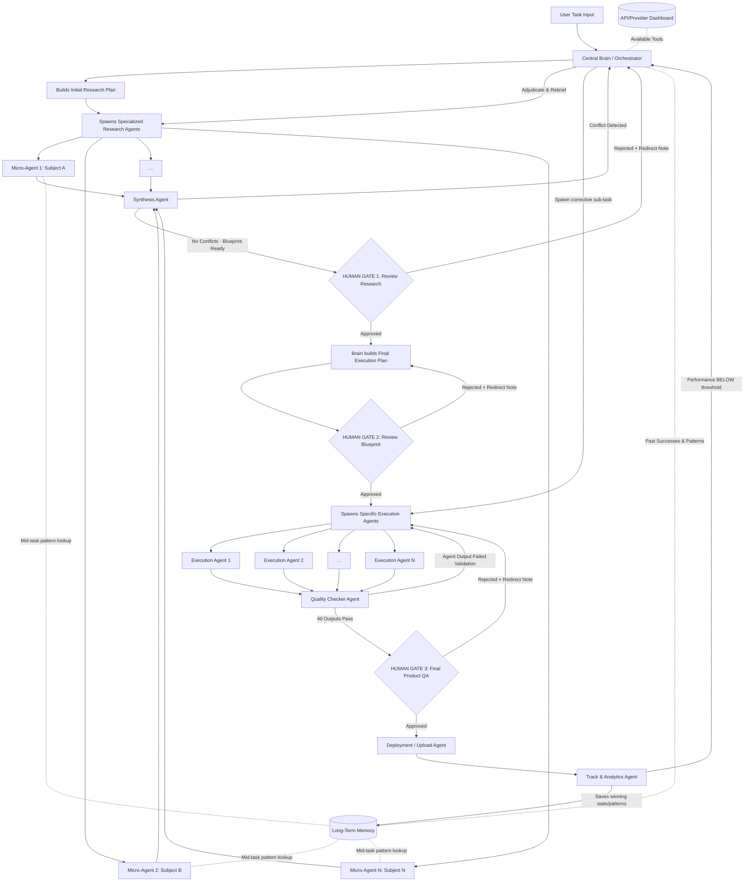

# Implementation Plan: Universal Autonomous Multi-Agent Architecture (Jarvis)

This document outlines the core operational architecture for Jarvis. It is designed to handle **any complex task** (marketing, coding, content creation, research) through a dynamic, multi-agent orchestration process.

## 1. Goal Description
To build a closed-loop, autonomous system where a Central Brain delegates tasks to highly specialized, dynamically spawned micro-agents. The system features two-stage planning (Research Plan -> Execution Plan), strict Human-in-the-Loop (HITL) approval gates with **rejection re-routing**, a conflict-resolving Synthesis Agent, a Quality Checker Agent, bidirectional Long-Term Memory, and a closed-loop performance feedback system.

---

## 2. Technical Safeguards

> [!TIP]
> **Modifications Added to the Core Script:**
>
> 1. **The Synthesis Mechanism:** If you spawn 12 research agents, they will return massive amounts of data. Passing all that raw data directly to the Execution Agents will overwhelm their context window. **Modification:** Added a `Synthesis Agent` right before Gate 1. It compresses the 12 reports into one hyper-dense blueprint.
> 2. **API Fallback Loop:** APIs break or hit rate limits. **Modification:** If a specialized agent hits an error (e.g., YouTube API is down), it doesn't crash the system. It signals the Brain, which instantly reads the Dashboard and assigns a backup API (e.g., Supadata) to finish the job.
> 3. **[FIX #2] Gate Rejection Re-routing:** All three HITL Gates now have explicit rejection paths. A human "No" is never a dead end — it routes back with the rejection reason attached as context, so the Brain or Execution layer knows exactly what to correct.
> 4. **[FIX #3] Conflict Resolution in Synthesis:** The Synthesis Agent now detects contradictory findings between research agents before producing the blueprint. Conflicts are flagged and escalated back to the Brain to adjudicate, not silently discarded.
> 5. **[FIX #4] Quality Checker Agent:** After execution agents finish but before Gate 3 human review, a lightweight Quality Checker Agent validates each agent's output. Failed agents are re-spawned automatically rather than blocking the gate with bad output.
> 6. **[FIX #5] Bidirectional Long-Term Memory:** Research Agents can now query the Long-Term Memory mid-task, not just at initiation. This means a Hook Researcher can see that "punchy opening lines under 5 words historically perform 80% better" before writing, not after.
> 7. **[FIX #6] Closed-Loop Performance Feedback:** If the Track Agent detects performance below a defined threshold (e.g., video CTR < 3%), it sends a signal back to the Brain to re-initiate a corrective sub-task. The loop never ends at deployment.

---

## 3. Proposed Architecture Flow (Fully Fixed)

---

## 4. Phase Breakdown

### Phase 1: The Central Brain (Orchestrator)
- **Action**: Receives the task, assesses difficulty, and determines the initial requirements.
- **Planning**: Creates an **Initial Implementation Plan** that strictly defines the research flow. It doesn't assume it knows how to execute yet.
- **Provisioning**: Reads the global API/MCP dashboard and grants the necessary tools to the agents.
- **Memory Read**: Queries Long-Term Memory for any relevant past patterns *before* spawning agents.

### Phase 2: Parallel Micro-Research Agents
- **Action**: The Brain spawns highly specialized micro-agents to understand *how* to do the task perfectly.
- **Example (Video)**: `Hook Researcher`, `Body Researcher`, `CTA Researcher`, `SEO Researcher`, `Comment Researcher`.
- **Example (Coding)**: `Architecture Researcher`, `Dependency Researcher`, `Security Researcher`.
- **[FIX #5] Bidirectional Memory**: Each Research Agent can issue a memory query mid-task (e.g., "What hook formats worked above 70% retention?") and get back relevant patterns from past successful runs.
- **API Selection**: Agents review available APIs/MCPs and tell the Brain which ones they need. (Fallback loop engages if an API fails).

### Phase 3: Synthesis Agent + Conflict Resolution [FIX #3]
- **Compression**: Synthesis Agent compresses all N parallel research reports into one hyper-dense blueprint.
- **[FIX #3] Conflict Detection**: Before generating the blueprint, the Synthesis Agent checks for contradictions across agent reports (e.g., one agent says "use TikTok API", another says "TikTok API is down"). If detected:
  - Conflicts are flagged with the specific contradiction described.
  - The signal routes back to the Brain, not to the gate.
  - Brain adjudicates (either resolves it or re-spawns only the conflicting agents with corrected briefings).
- **Gate 1**: The system pauses. The user reviews the aggregated research and approves or redirects.

### Phase 4: HUMAN GATE 1 [FIX #2]
- **Approved**: Brain proceeds to build the Final Execution Plan.
- **[FIX #2] Rejected**: The user attaches a redirect note (e.g., "Focus more on competitor SEO analysis, not just ours"). This note is passed back to the Brain as additional context. The Brain **does not restart from scratch** — it re-briefings only the relevant research agents and re-synthesises.

### Phase 5: Second Implementation Plan (Execution Blueprint)
- **Action**: Using the approved research, the Brain creates the **Final Implementation Plan**.
- **Dynamic Spawning**: The system spawns execution agents based *strictly* on what the research dictated was necessary.

### Phase 6: HUMAN GATE 2 [FIX #2]
- **Approved**: Execution agents are spawned and begin building.
- **[FIX #2] Rejected**: The redirect note routes back to the Second Implementation Plan stage. The Brain adjusts the blueprint (e.g., "swap out the Python backend for Node.js") without restarting research.

### Phase 7: Execution + Quality Checker [FIX #4]
- **Execution**: Spawned agents build the final product using their designated APIs.
- **[FIX #4] Quality Checker Agent**: After all execution agents return their outputs, a Quality Checker Agent runs lightweight validation:
  - For code: Does it compile? Are there obvious runtime errors?
  - For content: Is the word count / format correct? Does it match the brief spec?
  - For video: Did the render complete? Is the file uncorrupted?
  - **Pass**: All outputs proceed to Gate 3.
  - **Fail**: The specific failed agent(s) are flagged and re-spawned, not the entire execution batch.

### Phase 8: HUMAN GATE 3 [FIX #2]
- **Approved**: Deployment Agent authenticates and pushes the product live.
- **[FIX #2] Rejected**: The redirect note routes back to SpawnExec. Only the specific component the user rejected needs to be rebuilt, not the entire execution batch.

### Phase 9: Deployment Agent
- Authenticates with the relevant platform (YouTube API, GitHub, Stripe, etc.) and pushes the product live.

### Phase 10: Closed-Loop Tracking [FIX #6]
- **Action**: The `Track Agent` monitors live stats post-deployment (views, CTR, error rates, conversion rates).
- **[FIX #6] Memory Save (Wins)**: If performance is ABOVE threshold — extracts the *why* (e.g., "This intro hooked 80% of viewers") and saves the pattern into Long-Term Memory.
- **[FIX #6] Corrective Loop (Losses)**: If performance is BELOW a defined threshold (e.g., CTR < 3%, error rate > 5%):
  - Track Agent sends a failure signal back to the Brain.
  - Brain spawns a **corrective sub-task** (e.g., "Re-cut the hook", "Patch the failing endpoint").
  - This sub-task re-enters the pipeline at Phase 7 (Execution), bypassing the research phase.
  - The loop is genuinely closed — deployment is not the end state.

---

## 5. What You Already Have vs. What You Need to Build

### ✅ Already Built
| Component | File | Status |
|---|---|---|
| Central Brain (single-agent) | `coordinator.py` | Working — needs multi-agent upgrade |
| Tool calling (DB, search) | `coordinator.py` | Working |
| Long-Term Memory (tasks + notes) | `db.py` | Working — needs pattern storage table |
| Flask API server | `jarvis.py` | Working |
| Wake word + voice | `jarvis.py` | Working |
| Brain Interface UI | `agent_map_final.html` | Working (Three.js nebula) |
| Pipeline Coordinator UI | `jarvis_plan_preview.html` | Prototype — needs backend wiring |
| API/MCP Connectors (stubs) | `connectors/` | Stubs only — need real implementations |

### 🔧 What Needs to Be Built

**Priority 1 — Core Multi-Agent Engine** (`multi_agent_coordinator.py`)
- Spawns N sub-agents as parallel async tasks (using `asyncio` + Gemini/Claude calls)
- Each sub-agent gets a scoped system prompt, specific tools, and a memory query hook
- Returns structured JSON results back to Brain

**Priority 2 — Synthesis Agent** (new function in coordinator)
- Takes N agent result dicts
- Runs conflict detection (checks if any two agents have contradictory claims on the same key)
- Produces a single compressed blueprint dict

**Priority 3 — Quality Checker Agent** (new function in coordinator)
- Validates execution agent outputs against a spec passed in from the blueprint
- Returns pass/fail per agent with a reason string

**Priority 4 — Memory Pattern Table** (add to `db.py`)
- New `memory_patterns` table: `pattern_text`, `outcome_metric`, `metric_value`, `task_type`, `created_at`
- Research Agents query this table mid-task via a `search_memory_patterns(query)` tool
- Track Agent writes to it post-deployment

**Priority 5 — HITL Gate API Endpoints** (add to `jarvis.py`)
- `POST /gate/approve` — advances pipeline to next phase
- `POST /gate/reject` — sends redirect note back to Brain, re-routes pipeline
- `GET /gate/status` — returns current gate the pipeline is paused at

**Priority 6 — UI Wiring** (`jarvis_plan_preview.html`)
- The Approve/Reject buttons already exist in the UI
- Wire them to the Flask `/gate/approve` and `/gate/reject` endpoints via `fetch()`
- The pipeline status columns should poll `/gate/status` to show which stage is active

**Priority 7 — Track Agent + Feedback Loop**
- A background thread (or cron) that polls deployment metrics (YouTube API, GA, etc.)
- Compares against threshold stored in task metadata
- Calls Brain's `handle_corrective_request()` if below threshold
