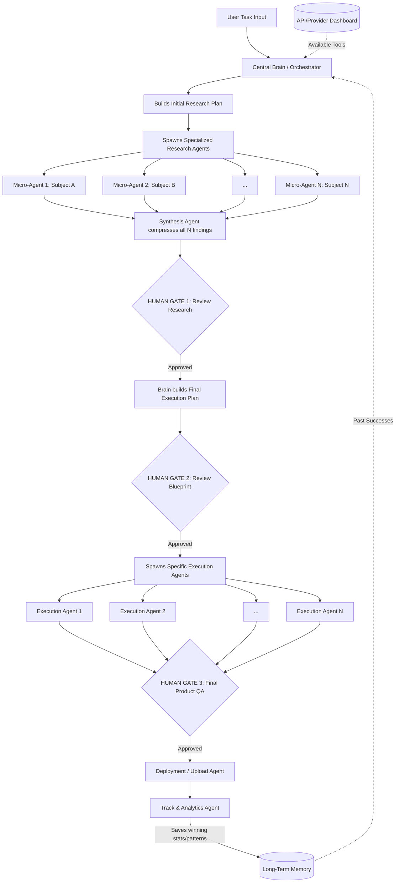

# Implementation Plan: Universal Autonomous Multi-Agent Architecture (Jarvis)

This document outlines the core operational architecture for Jarvis. It is designed to handle **any complex task** (marketing, coding, content creation, research) through a dynamic, multi-agent orchestration process.

## 1. Goal Description
To build a closed-loop, autonomous system where a Central Brain delegates tasks to highly specialized, dynamically spawned micro-agents. The system features two-stage planning (Research Plan -> Execution Plan), strict Human-in-the-Loop (HITL) approval gates, and a self-improving memory module.

## 2. Technical Safeguards Added

> [!TIP]
> **Modifications Added to the Core Script:**
> 
> 1. **The Synthesis Mechanism:** If you spawn 12 research agents, they will return massive amounts of data. Passing all that raw data directly to the Execution Agents will overwhelm their context window. **Modification:** Added a `Synthesis Agent` right before Gate 1. It compresses the 12 reports into one hyper-dense blueprint.
> 2. **API Fallback Loop:** APIs break or hit rate limits. **Modification:** If a specialized agent hits an error (e.g., YouTube API is down), it doesn't crash the system. It signals the Brain, which instantly reads the Dashboard and assigns a backup API (e.g., Supadata) to finish the job.

## 3. Proposed Architecture Flow

## 4. Phase Breakdown

### Phase 1: The Central Brain (Orchestrator)
- **Action**: Receives the task, assesses difficulty, and determines the initial requirements.
- **Planning**: Creates an **Initial Implementation Plan** that strictly defines the research flow. It doesn't assume it knows how to execute yet.
- **Provisioning**: Reads the global API/MCP dashboard and grants the necessary tools to the agents.

### Phase 2: Parallel Micro-Research Agents
- **Action**: The Brain spawns highly specialized micro-agents to understand *how* to do the task perfectly.
- **Example (Video)**: `Hook Researcher`, `Body Researcher`, `CTA Researcher`, `SEO Researcher`, `Comment Researcher`.
- **Example (Coding)**: `Architecture Researcher`, `Dependency Researcher`, `Security Researcher`.
- **API Selection**: Agents review available APIs/MCPs and tell the Brain which ones they need. (Fallback loop engages if an API fails).

### Phase 3: HUMAN GATE 1 & The Synthesis Agent
- **Synthesis**: A Synthesis Agent compresses the massive parallel research into a digestible format.
- **Gate 1**: The system pauses. The user reviews the aggregated research and approves or redirects the agents.

### Phase 4: Second Implementation Plan (Execution Blueprint)
- **Action**: Using the approved research, the Brain creates the **Final Implementation Plan**.
- **Dynamic Spawning**: The system spawns execution agents based *strictly* on what the research dictated was necessary.

### Phase 5: HUMAN GATE 2 & Execution
- **Gate 2**: Execution pauses. The user reviews the script, code architecture, or campaign blueprint before production begins.
- **Execution**: The spawned agents build the final product using their designated APIs.

### Phase 6: HUMAN GATE 3 & Deployment
- **Gate 3**: The user reviews the final rendered video, compiled codebase, or finished copy.
- **Deployment**: The Deployment Agent authenticates and pushes the product live.

### Phase 7: Closed-Loop Tracking (The Memory)
- **Action**: The `Track Agent` monitors live stats post-deployment.
- **Memory Save**: It extracts the *why* (e.g., "This intro hooked 80% of viewers") and saves it into Long-Term Memory, making the Central Brain permanently smarter.
