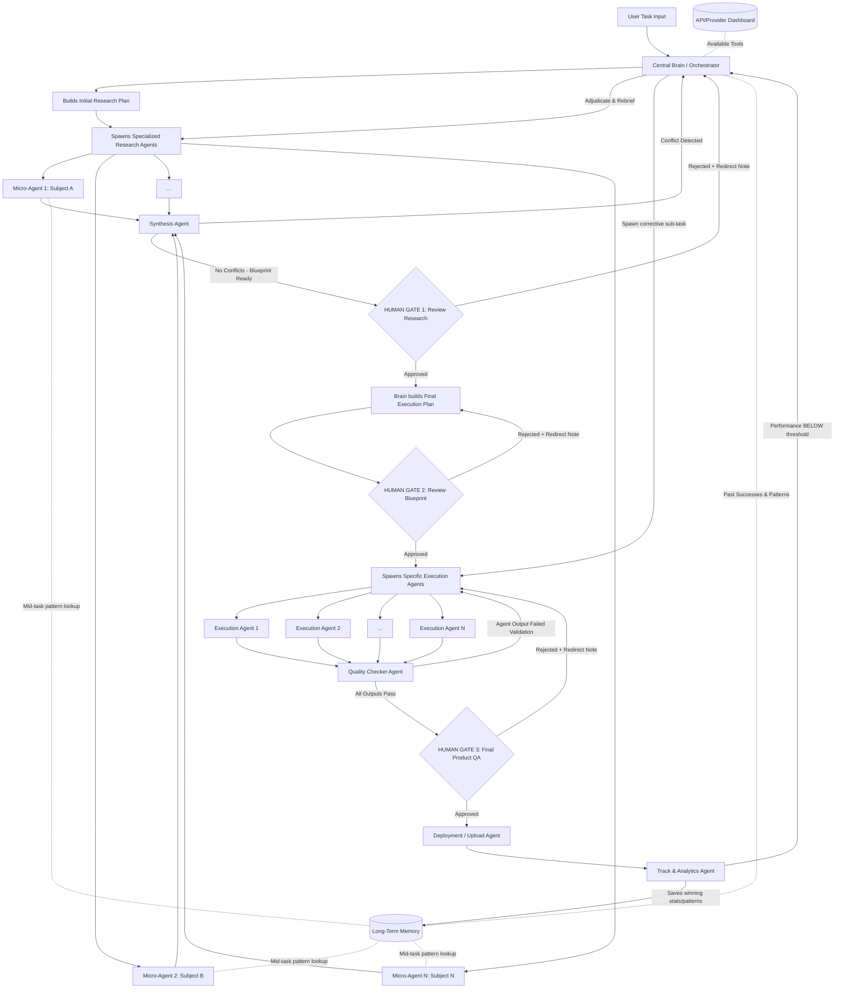

# Implementation Plan: Universal Autonomous Multi-Agent Architecture (Jarvis)

This document outlines the core operational architecture for Jarvis. It is designed to handle **any complex task** (marketing, coding, content creation, research) through a dynamic, multi-agent orchestration process.

## 1. Goal Description
To build a closed-loop, autonomous system where a Central Brain delegates tasks to highly specialized, dynamically spawned micro-agents. The system features two-stage planning (Research Plan -> Execution Plan), strict Human-in-the-Loop (HITL) approval gates with **rejection re-routing**, a conflict-resolving Synthesis Agent, a Quality Checker Agent, bidirectional Long-Term Memory, and a closed-loop performance feedback system.

---

## 2. Technical Safeguards

> [!TIP]
> **Modifications Added to the Core Script:**
>
> 1. **The Synthesis Mechanism:** If you spawn 12 research agents, they will return massive amounts of data. Passing all that raw data directly to the Execution Agents will overwhelm their context window. **Modification:** Added a `Synthesis Agent` right before Gate 1. It compresses the 12 reports into one hyper-dense blueprint. **⚠️ CRITICAL: "Compress" means an LLM reads ALL agent reports and produces a unified blueprint incorporating the best insights from each. It does NOT mean flattening dicts and picking the first value per key — that silently discards all but one agent's work.**
> 2. **API Fallback Loop:** APIs break or hit rate limits. **Modification:** If a specialized agent hits an error (e.g., YouTube API is down), it doesn't crash the system. It signals the Brain, which instantly reads the Dashboard and assigns a backup API (e.g., Supadata) to finish the job.
> 3. **[FIX #2] Gate Rejection Re-routing:** All three HITL Gates now have explicit rejection paths. A human "No" is never a dead end — it routes back with the rejection reason attached as context, so the Brain or Execution layer knows exactly what to correct.
> 4. **[FIX #3] Conflict Resolution in Synthesis:** The Synthesis Agent now detects contradictory findings between research agents before producing the blueprint. Conflicts are flagged and escalated back to the Brain to adjudicate, not silently discarded.
> 5. **[FIX #4] Quality Checker Agent:** After execution agents finish but before Gate 3 human review, a lightweight Quality Checker Agent validates each agent's output. Failed agents are re-spawned automatically rather than blocking the gate with bad output.
> 6. **[FIX #5] Bidirectional Long-Term Memory:** Research Agents can now query the Long-Term Memory mid-task, not just at initiation. This means a Hook Researcher can see that "punchy opening lines under 5 words historically perform 80% better" before writing, not after.
> 7. **[FIX #6] Closed-Loop Performance Feedback:** If the Track Agent detects performance below a defined threshold (e.g., video CTR < 3%), it sends a signal back to the Brain to re-initiate a corrective sub-task. The loop never ends at deployment.

---

## 3. Proposed Architecture Flow (Fully Fixed)



---

## 4. Phase Breakdown

### Phase 1: The Central Brain (Orchestrator)
- **Action**: Receives the task, assesses difficulty, and determines the initial requirements.
- **Planning**: Creates an **Initial Implementation Plan** that strictly defines the research flow. It doesn't assume it knows how to execute yet.
- **Provisioning**: Reads the global API/MCP dashboard and grants the necessary tools to the agents.
- **Memory Read**: Queries Long-Term Memory for any relevant past patterns *before* spawning agents.

### Phase 2: Parallel Micro-Research Agents
- **Action**: The Brain spawns highly specialized micro-agents to understand *how* to do the task perfectly.
- **Example (Video)**: `Hook Researcher`, `Body Researcher`, `CTA Researcher`, `SEO Researcher`, `Comment Researcher`.
- **Example (Coding)**: `Architecture Researcher`, `Dependency Researcher`, `Security Researcher`.
- **[FIX #5] Bidirectional Memory**: Each Research Agent can issue a memory query mid-task (e.g., "What hook formats worked above 70% retention?") and get back relevant patterns from past successful runs.
- **API Selection**: Agents review available APIs/MCPs and tell the Brain which ones they need. (Fallback loop engages if an API fails).

### Phase 3: Synthesis Agent + Conflict Resolution [FIX #3]
- **Compression**: Synthesis Agent compresses all N parallel research reports into one hyper-dense blueprint.
  > **⚠️ ANTI-PATTERN WARNING:** "Compress" must NOT be implemented as naive dict-merging or picking one agent's value per key. The Synthesis Agent must use a structured LLM call that reads ALL N agent reports in full and produces a single unified blueprint that incorporates the best insights from each agent. Any implementation that flattens results into `{key: entries[0]["value"]}` silently discards all but one agent's findings and defeats the purpose of parallel research.
- **[FIX #3] Conflict Detection & Choice Resolution**: Before generating the blueprint, the Synthesis Agent checks for contradictions across agent reports (e.g., one agent says "use TikTok API", another says "TikTok API is down"), as well as competing tool/API recommendations. 
  - If a conflict or multiple competing options (APIs/MCPs) are detected:
    - They are formatted into a structured list of options.
    - Each option must explicitly show **"Why use it (Pros)"** and **"Why not use it (Cons)"**.
    - The signal and options route back to the Brain and are presented directly to the user at Gate 1.
    - **User Resolution**: The user is presented with a checkbox interface where they can see the comparison and select one or *multiple* APIs/MCPs/options to be used simultaneously.
  - Conflicts are flagged with the specific contradiction described.
  - The signal routes back to the Brain, not to the gate.
  - Brain adjudicates (either resolves it or re-spawns only the conflicting agents with corrected briefings).
  > **⚠️ ANTI-PATTERN WARNING:** Conflict detection must NOT compare stringified dict values across agents for matching keys. Research agents produce unique `findings` dicts with different keys — they will almost never share keys, so real semantic contradictions (e.g., Agent A says "use React" while Agent B says "React is not suitable for this use case") will be silently missed. Conflict detection must be performed by an LLM that reads all findings and identifies logical/semantic contradictions.
- **Gate 1**: The system pauses. The user reviews the aggregated research, the compiled blueprint, and any unresolved options/conflicts (allowing them to multi-select tools/APIs with pros/cons), and approves or redirects.

### Phase 4: HUMAN GATE 1 [FIX #2]
- **Approved**: Brain proceeds to build the Final Execution Plan.
- **[FIX #2] Rejected**: The user attaches a redirect note (e.g., "Focus more on competitor SEO analysis, not just ours"). This note is passed back to the Brain as additional context. The Brain **does not restart from scratch** — it re-briefs only the relevant research agents and re-synthesises.
  > **⚠️ ANTI-PATTERN WARNING:** "Re-briefs only the relevant research agents" must NOT be implemented as re-running ALL agents. The Brain must parse the redirect note to identify which specific agent(s) need re-briefing, then spawn only those. After they return, the Synthesis Agent must re-run using the mix of old (unchanged) + new (re-run) agent results — not discard the old results.

### Phase 5: Second Implementation Plan (Execution Blueprint)
- **Action**: Using the approved research, the Brain creates the **Final Implementation Plan**.
- **Dynamic Spawning**: The system spawns execution agents based *strictly* on what the research dictated was necessary.

### Phase 6: HUMAN GATE 2 [FIX #2]
- **Approved**: Execution agents are spawned and begin building.
- **[FIX #2] Rejected**: The redirect note routes back to the Second Implementation Plan stage. The Brain adjusts the blueprint (e.g., "swap out the Python backend for Node.js") without restarting research.

### Phase 7: Execution + Quality Checker [FIX #4]
- **Execution**: Spawned agents build the final product using their designated APIs.
- **[FIX #4] Quality Checker Agent**: After all execution agents return their outputs, a Quality Checker Agent runs lightweight validation:
  - For code: Does it compile? Are there obvious runtime errors?
  - For content: Is the word count / format correct? Does it match the brief spec?
  - For video: Did the render complete? Is the file uncorrupted?
  - **Pass**: All outputs proceed to Gate 3.
  - **Fail**: The specific failed agent(s) are flagged and re-spawned, not the entire execution batch.

### Phase 8: HUMAN GATE 3 [FIX #2]
- **Approved**: Deployment Agent authenticates and pushes the product live.
- **[FIX #2] Rejected**: The redirect note routes back to SpawnExec. Only the specific component the user rejected needs to be rebuilt, not the entire execution batch.
  > **⚠️ ANTI-PATTERN WARNING:** "Only the specific component" must NOT be implemented as re-running `run_execution_phase()` with the full agent plan (which re-spawns ALL agents). The redirect note must be parsed (by the Brain via LLM) to identify which specific agent ID(s) produced the rejected component, then only those agents are re-spawned. The final result set must merge the re-run outputs with the previously-approved outputs.

### Phase 9: Deployment Agent
- Authenticates with the relevant platform (YouTube API, GitHub, Stripe, etc.) and pushes the product live.

### Phase 10: Closed-Loop Tracking [FIX #6]
- **Action**: The `Track Agent` monitors live stats post-deployment (views, CTR, error rates, conversion rates).
- **[FIX #6] Memory Save (Wins)**: If performance is ABOVE threshold — extracts the *why* (e.g., "This intro hooked 80% of viewers") and saves the pattern into Long-Term Memory.
  > **⚠️ ANTI-PATTERN WARNING:** "Extracts the *why*" must NOT be a simple copy of the metric value into the `memory_patterns` table (e.g., just saving `{"pattern": "ctr was 8%"}`). The Track Agent must use an LLM call that receives the full execution blueprint + the performance data and produces an actionable insight (e.g., "Opening with a question under 5 words correlated with 80% 30-second retention"). Raw metrics without causal analysis are useless as memory patterns.
- **[FIX #6] Corrective Loop (Losses)**: If performance is BELOW a defined threshold (e.g., CTR < 3%, error rate > 5%):
  - Track Agent sends a failure signal back to the Brain.
  - Brain spawns a **corrective sub-task** (e.g., "Re-cut the hook", "Patch the failing endpoint").
  - This sub-task re-enters the pipeline at Phase 7 (Execution), bypassing the research phase.
  - The loop is genuinely closed — deployment is not the end state.

---

## 5. What You Already Have vs. What You Need to Build

### ✅ Already Built
| Component | File | Status |
|---|---|---|
| Central Brain (single-agent) | `coordinator.py` | Working — needs multi-agent upgrade |
| Tool calling (DB, search) | `coordinator.py` | Working |
| Long-Term Memory (tasks + notes) | `db.py` | Working — needs pattern storage table |
| Flask API server | `jarvis.py` | Working |
| Wake word + voice | `jarvis.py` | Working |
| Brain Interface UI | `agent_map_final.html` | Working (Three.js nebula) |
| Pipeline Coordinator UI | `jarvis_plan_preview.html` | Prototype — needs backend wiring |
| API/MCP Connectors (stubs) | `connectors/` | Stubs only — need real implementations |

### 🔧 What Needs to Be Built

**Priority 1 — Core Multi-Agent Engine** (`multi_agent_coordinator.py`)
- Spawns N sub-agents as parallel async tasks (using `asyncio` + Gemini/Claude calls)
- Each sub-agent gets a scoped system prompt, specific tools, and a memory query hook
- Returns structured JSON results back to Brain

**Priority 2 — Synthesis Agent** (new function in coordinator)
- Takes N agent result dicts
- Runs conflict detection via a structured LLM call that identifies semantic contradictions across findings (NOT naive key-comparison)
- Produces a single compressed blueprint dict via a second LLM call that reads ALL agent reports and synthesises the best insights into one unified blueprint (NOT by picking one agent's value per key)

**Priority 3 — Quality Checker Agent** (new function in coordinator)
- Validates execution agent outputs against a spec passed in from the blueprint
- Returns pass/fail per agent with a reason string

**Priority 4 — Memory Pattern Table** (add to `db.py`)
- New `memory_patterns` table: `pattern_text`, `outcome_metric`, `metric_value`, `task_type`, `created_at`
- Research Agents query this table mid-task via a `search_memory_patterns(query)` tool
- Track Agent writes to it post-deployment

**Priority 5 — HITL Gate API Endpoints** (add to `jarvis.py`)
- `POST /gate/approve` — advances pipeline to next phase
- `POST /gate/reject` — sends redirect note back to Brain, re-routes pipeline
- `GET /gate/status` — returns current gate the pipeline is paused at

**Priority 6 — UI Wiring** (`jarvis_plan_preview.html`)
- The Approve/Reject buttons already exist in the UI
- Wire them to the Flask `/gate/approve` and `/gate/reject` endpoints via `fetch()`
- The pipeline status columns should poll `/gate/status` to show which stage is active

**Priority 7 — Track Agent + Feedback Loop**
- A background thread (or cron) that polls deployment metrics (YouTube API, GA, etc.)
- Compares against threshold stored in task metadata
- Calls Brain's `handle_corrective_request()` if below threshold

**Priority 8 — Agent Monitor Dashboard** (new UI panel in `command_center.html` or dedicated page)

The pipeline needs a real-time observability layer so you can see exactly what every agent is doing, what they're saying to the Brain, and inspect any individual agent's plan/output at any time. This consists of three views accessible from a shared toolbar:

#### 8a. Agent Inspector (Dropdown Selector)
- A **dropdown / select box** listing every agent currently spawned or previously run in the active pipeline, grouped by phase:
  ```
  ── Research Agents ──
  agent_research_1 — Hook Researcher [✅ done]
  agent_research_2 — SEO Researcher [⏳ running]
  agent_research_3 — CTA Researcher [❌ error]
  ── Execution Agents ──
  agent_exec_1 — Script Writer [⏳ running]
  agent_exec_2 — Thumbnail Designer [🕐 queued]
  ── System Agents ──
  Synthesis Agent [✅ done]
  Quality Checker [🕐 queued]
  ```
- When you **select an agent** from the dropdown, a detail panel shows:
  - **Agent Config**: role, brief, tools_needed, memory_query
  - **Status**: queued / running / done / error
  - **Input**: The system prompt and context it was given (including memory patterns injected)
  - **Output**: The full JSON result it returned (findings, confidence, sources, recommendation)
  - **Duration**: How long it ran (start time → end time)
  - **Error details**: If status is `error`, the full exception/traceback

#### 8b. View Actions (Button)
- A **"View Actions"** button next to the dropdown opens a **live activity feed** showing what every agent and system component is doing right now, in chronological order:
  ```
  [10:05:12] Brain → Built research plan (6 agents)
  [10:05:13] agent_research_1 (Hook Researcher) → Spawned
  [10:05:13] agent_research_2 (SEO Researcher) → Spawned
  [10:05:13] agent_research_3 (CTA Researcher) → Spawned
  [10:05:18] agent_research_1 → Queried memory: "hook formats high retention"
  [10:05:22] agent_research_1 → Completed (confidence: 0.87)
  [10:05:25] agent_research_3 → ERROR: Google Search API rate limited
  [10:05:26] Brain → Re-spawning agent_research_3 with fallback tools
  [10:05:30] agent_research_2 → Completed (confidence: 0.91)
  [10:05:35] agent_research_3 → Completed (confidence: 0.74)
  [10:05:36] Synthesis Agent → Running conflict detection...
  [10:05:38] Synthesis Agent → No conflicts. Blueprint ready.
  [10:05:38] GATE 1 → Waiting for human approval
  ```
- Each entry is color-coded: 🟢 success, 🟡 in-progress, 🔴 error, 🔵 system/gate
- Auto-scrolls to latest, with a "pin" toggle to freeze scrolling

#### 8c. View Interactions (Button)
- A **"View Interactions"** button opens a **full communication log** showing every message passed between agents, the Brain, and the system — formatted like a chat transcript:
  ```
  ┌─────────────────────────────────────────┐
  │ Brain → agent_research_1                │
  │ SYSTEM PROMPT: You are a Hook           │
  │ Researcher agent...                     │
  │ BRIEF: Research the best hook formats   │
  │ for YouTube videos about AI tools...    │
  │ MEMORY CONTEXT: [3 patterns injected]   │
  ├─────────────────────────────────────────┤
  │ agent_research_1 → Brain                │
  │ {                                       │
  │   "agent_id": "agent_research_1",       │
  │   "confidence": 0.87,                   │
  │   "findings": { ... },                  │
  │   "recommendation": "Use question-      │
  │   based hooks under 5 words"            │
  │ }                                       │
  ├─────────────────────────────────────────┤
  │ Synthesis Agent → Brain                 │
  │ CONFLICT: agent_research_2 says "use    │
  │ TikTok API" but agent_research_4 says   │
  │ "TikTok API is rate-limited"            │
  ├─────────────────────────────────────────┤
  │ Brain → agent_research_2               │
  │ RE-BRIEF: TikTok API confirmed down.   │
  │ Switch to Supadata fallback...          │
  └─────────────────────────────────────────┘
  ```
- Filterable by: agent ID, direction (inbound/outbound), phase, message type (prompt / result / conflict / gate decision)
- Expandable JSON blocks (collapsed by default for large outputs)

#### Backend Requirements
The following data structures and endpoints are needed to power the dashboard:

**In-memory event log** (add to `jarvis.py`):
- `AGENT_EVENT_LOG: list[dict]` — append-only log of all agent lifecycle events
- Each event: `{"timestamp", "source", "target", "event_type", "phase", "data"}`
- Event types: `spawned`, `running`, `completed`, `error`, `memory_query`, `conflict`, `gate_waiting`, `gate_resolved`, `re-spawned`

**Agent registry** (add to `jarvis.py`):
- `AGENT_REGISTRY: dict[str, dict]` — maps agent_id to its full config + current status + output
- Updated by the multi_agent_coordinator as agents are spawned and complete

**New API endpoints** (add to `jarvis.py`):
- `GET /agents` — returns the full agent registry (all agents, their configs, status, outputs)
- `GET /agents/<agent_id>` — returns a single agent's full detail
- `GET /agents/events` — returns the event log (supports `?since=<timestamp>` for polling)
- `GET /agents/interactions` — returns the interaction log (all prompts sent and results received)

---


## 6. What is Missing From This Plan

> [!IMPORTANT]
> **Audit methodology:** Every claim below was cross-referenced against the actual codebase files. Items previously listed as "missing" that already exist in code have been corrected.

---

### ✅ Items Previously Listed as Missing That Actually Already Exist

**1. Priority 4 — Memory Pattern Table:** The plan says to create a new `memory_patterns` table, but `db.py` (lines 40–48) already has this table with columns `pattern`, `task_type`, `metric_name`, `metric_value`, `outcome`, `created_at`. The functions `save_memory_pattern()` and `search_memory_patterns()` are also already implemented (lines 388–410). **The plan's column names (`pattern_text`, `outcome_metric`) don't match the existing schema (`pattern`, `metric_name`) — this inconsistency should be resolved by using the existing schema.**

**2. Priority 5 — HITL Gate API Endpoints:** The plan says to build `/gate/approve`, `/gate/reject`, and `/gate/status`. All three already exist in `jarvis.py` (lines 754–783). The gate synchronization mechanism (polling `PIPELINE_STATE` via `asyncio.sleep(2)` in `start_pipeline_local`) is also already implemented (lines 450–485). **These are done.**

**3. Priority 1 — Core Multi-Agent Engine:** `multi_agent_coordinator.py` already exists with `run_research_phase()`, `run_execution_phase()`, and `run_full_pipeline()` fully wired. It spawns N agents in parallel via `asyncio.gather`, handles `return_exceptions=True`, and connects to all three gates. **The engine is built.**

---

### 🔴 Items That Are Genuinely Missing

**1. Synthesis Agent Uses Naive String Comparison — No LLM-Powered Conflict Detection**
- `agents/synthesis.py` detects "conflicts" by flattening all agent results into a dict and checking if `str(value)` differs across agents for the same key (line 29). This is fundamentally broken for real use because:
  - Research agents return nested `findings` dicts with different keys (e.g., one agent returns `{"seo_strategy": "..."}`, another returns `{"hook_analysis": "..."}`). They will almost never share the same key, so real contradictions will be silently missed.
  - Conversely, meta-fields like `findings` itself will ALWAYS differ (it's a dict unique to each agent), triggering false positives.
- **What's needed:** Replace the naive key-comparison with a structured LLM call (Gemini `response_mime_type="application/json"`) that reads all agent findings and identifies logical/semantic contradictions. The current `SKIP_KEYS` band-aid is insufficient.

**2. No Deployment Agent Exists**
- The plan describes a "Deployment Agent" (Phase 9) that authenticates with YouTube, GitHub, Stripe, etc. and pushes products live. No such agent exists in `agents/`. The pipeline in `multi_agent_coordinator.py` ends at line 212 with `"ready_for_deploy": True` — it just returns a dict saying "ready" but never actually deploys anything.
- **What's needed:** An `agents/deployment_agent.py` that takes the final execution results + a target platform config and performs the actual deployment (API upload, git push, etc.).

**3. No Track Agent Exists**
- The plan describes a "Track & Analytics Agent" (Phase 10) that monitors live metrics post-deployment and triggers corrective loops. No such agent exists. `jarvis.py` has a `TRACKED_METRICS` dict and `/metrics/update` + `/metrics/get` endpoints, but these are passive — nothing actively polls external APIs, compares against thresholds, or triggers `Brain.handle_corrective_request()`.
- **What's needed:** An `agents/track_agent.py` that runs as a background thread/cron, polls deployment metrics from external APIs (YouTube Analytics, Google Analytics, etc.), compares against thresholds stored in task metadata, saves winning patterns to `memory_patterns`, and signals the Brain to spawn corrective sub-tasks when below threshold.

**4. No API/Provider Dashboard Exists**
- The plan's Phase 1 says the Brain "reads the global API/MCP dashboard" to provision agents with the right tools. No such dashboard exists in code. The `connectors/` directory has only placeholder stubs (`api_connector.py` and `mcp_connector.py`) that return `{"status": "not_configured"}` for every call.
- Research agents in `research_agent.py` hardcode `tools_list = [{"google_search": {}}]` regardless of what `tools_needed` the Brain specified in its plan.
- **What's needed:**
  1. A registry/config file mapping service names to their API keys, endpoints, and status (up/down/rate-limited).
  2. Logic in the research/execution agents to actually read `tools_needed` from their config and dynamically construct the tools list.
  3. The API Fallback Loop described in Technical Safeguard #2 — currently if an API fails, the agent just returns an error. Nothing signals the Brain to reassign a backup API.

**5. No Partial Re-Execution on Gate 3 Rejection**
- The plan (Phase 8 / FIX #2) says Gate 3 rejection should re-build "only the specific component the user rejected, not the entire execution batch." But `multi_agent_coordinator.py` lines 200–203 just re-runs `run_execution_phase()` with the full `agent_plan`, which re-spawns ALL execution agents — not just the rejected one.
- **What's needed:** Parse the `redirect_note` from Gate 3 to identify which specific agent(s) need re-execution, then spawn only those agents. The current implementation is a full re-run disguised as partial.

**6. Quality Checker Is Schema-Only — No Semantic Validation**
- `agents/quality_checker.py` only checks: (a) required JSON keys present, (b) word count meets minimum, (c) agent self-reported error. It does not verify whether the content actually matches the brief, tone, or spec — e.g., if the Brain asked for a "professional blog post" and the agent returned a casual tweet-length response that happened to have the right keys, it would pass QA.
- **What's needed:** A hybrid approach: keep the fast schema checks, then add a lightweight LLM call to evaluate semantic adherence to the brief/spec (e.g., "Does this output match the tone and requirements described in the blueprint?").

**7. No Max Retry / Infinite Loop Guard**
- The conflict resolution loop (lines 130–136 in `multi_agent_coordinator.py`) can loop infinitely: if synthesis detects a conflict, it re-plans and re-runs research, then re-synthesises — but if the conflict persists, it will loop forever. Same issue with Gate rejections — there's no cap on how many times a human can reject and re-route.
- The QA re-spawn (lines 180–191) does exactly one retry, which is good, but the same pattern isn't applied elsewhere.
- **What's needed:** A configurable `MAX_RETRIES` (e.g., 3) for conflict resolution, gate rejection loops, and QA re-spawns. After exceeding the limit, escalate to the human with a clear "I've tried N times, here's what keeps failing" message instead of looping or silently giving up.

**8. Blueprint Compression Is Not Actually Compression**
- The Synthesis Agent's "compression" (line 47 of `synthesis.py`) just takes the first entry's value for each key: `{key: entries[0]["value"] for key, entries in merged.items()}`. This discards all but one agent's findings rather than actually synthesizing/compressing them into a unified blueprint.
- **What's needed:** An LLM-powered synthesis step that reads all N agent reports and produces a single dense blueprint that incorporates the best insights from each agent — not just picks one arbitrarily.
