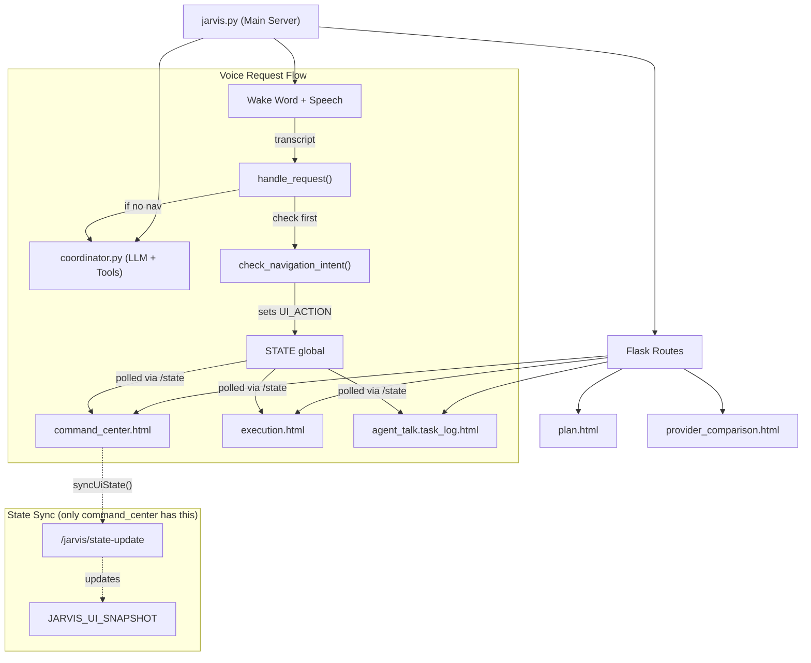

# Fix Execution-Mode Navigation Bug + Full Voice Control for Execution Page

## Background & Problem Statement

The Jarvis AI Assistant has a **Second Brain** interface with multiple pages:
- **Brain Core** (`command_center.html`) — 3D nebula with task nodes, home screen
- **Plan Page** (`plan.html`) — Project plans with phases and timelines
- **Execution Page** (`execution.html`) — Real-time pipeline execution constellation map
- **Task Logs/Chat** (`agent_talk.task_log.html`) — Console logs + agent dialogue stream
- **APIs/MCPs Page** (`provider_comparison.html`) — Compare AI providers

The user has reported two issues:
1. **Navigation Bug**: After switching Jarvis to "execution mode" (navigating to `execution.html`), subsequent voice commands like "go to plan" navigate to `brain/plan.html` instead of correctly navigating from within the execution context.
2. **Missing Commands**: The execution page has a rich new interface but lacks voice commands to control its many features.

---

## Clarification Q&A Results

| # | Question | Answer |
|---|----------|--------|
| 1 | Which exact navigation bug scenario? | **After switching to execution mode, ALL subsequent 'go to X' commands navigate to brain/X instead of staying in execution context** |
| 2 | What does "execution/chosen page" mean? | **Jarvis should navigate WITHIN execution.html sub-views (e.g. show idle view, show active pipeline, open agent panel, drill into a department)** |
| 3 | Which categories of new commands? | **ALL — pipeline management, agent constellation navigation, task constellation, console/log commands** |
| 4 | Should Jarvis control execution-page-specific UI elements? | **Yes — Jarvis should be able to control all execution.html-specific UI elements (side panels, drill-down, view switching)** |

---

## Full Codebase Analysis

### Architecture Overview



### Key Files Analyzed

#### 1. [jarvis.py](file:///d:/Charalambos/Desktop/AI/second-brain-voice/jarvis.py) (1983 lines, 77KB)
- **Lines 107-113**: Shared state globals (`UI_ACTION`, `ORB_STATE`, `CONVO`, etc.)
- **Lines 164-171**: `JARVIS_UI_SNAPSHOT` — tracks `current_page`, `panel_open`, `orb`, `sleeping`. Initialized to `"Brain Core"`. Updated ONLY by the frontend via `/jarvis/state-update`.
- **Lines 428-443**: `jarvis_tool_listener()` — handles `control_interface` tool calls from Gemini/Ollama. Maps actions like `go_to_execution` → `UI_ACTION = {"type": "navigate", "url": "execution.html"}`. The `else` branch (line 438-443) passes through any other action as `control_interface` type.
- **Lines 919-947**: `check_navigation_intent()` — Hardcoded text-matching for navigation keywords. Intercepts user speech BEFORE it reaches the LLM. Sets `UI_ACTION` directly. **Does NOT check `JARVIS_UI_SNAPSHOT["current_page"]`** — this is a critical gap.
- **Lines 949-961**: `handle_request()` — Calls `check_navigation_intent()` first. If it matches a navigation intent, returns immediately with a short reply without calling the LLM.
- **Lines 1093-1109**: `/state` endpoint — Returns `UI_ACTION` once then clears it (`UI_ACTION = None` at line 1108). This is what the frontend polls.
- **Lines 1143-1156**: `/jarvis/state-update` endpoint — Receives frontend state updates (current_page, panel_open, orb, sleeping).
- **Lines 1159-1183**: `/jarvis/snapshot` endpoint — Returns full UI + data snapshot for the LLM's `read_app_snapshot` tool.
- **Lines 1212-1222**: `/jarvis/ack` endpoint — Receives UI acknowledgements of completed actions.

#### 2. [coordinator.py](file:///d:/Charalambos/Desktop/AI/second-brain-voice/coordinator.py) (1095 lines, 50KB)
- **Lines 330-391**: `control_interface` tool definition — Has enum of actions: `go_to_plan`, `go_to_brain`, `go_to_apis`, `go_to_execution`, `open_side_panel`, `close_side_panel`, `open_notes_panel`, `open_settings_panel`, `focus_task`, `open_task_detail`, `exit_completely`, `wake_up`, `go_to_sleep`, `flash_notification`, `reset_camera`. **Does NOT have ANY execution-page-specific actions.**
- **Lines 381-387**: `payload` property — only supports `task_id` (int) and `message` (str). **Needs `department` (str) and `agent_id` (str) for execution commands.**
- **Lines 693-745**: `UI_MAP` — System prompt text that tells the LLM what pages/panels exist and how to navigate. **Does NOT mention execution page sub-views, idle/active views, drill-down, or agent panels.**
- **Lines 747-769**: `SYSTEM_PROMPT` — 15 rules for Jarvis behavior. Navigation rules say to always call `read_app_snapshot` first. **No rule about context-aware navigation.**
- **Lines 1034-1053**: Ollama instant-reply map — Maps `control_interface` actions to instant spoken responses. **Missing `go_to_execution` entry**, and no entries for new execution actions.

#### 3. [execution.html](file:///d:/Charalambos/Desktop/AI/second-brain-voice/execution.html) (2222 lines, 102KB)
- **Lines 612-617**: Navigation buttons (Execution, Task Logs/Chat, Plan, APIs/MCPs). Plan link uses `?from=execution` query param.
- **Lines 622-655**: **Idle View** — Task constellation map (shown when no pipeline running)
- **Lines 660-709**: **Active View** — Department execution constellation map (shown when pipeline running)
- **Lines 716-758**: View switching logic (`switchToActiveView()`, `switchToIdleView()`) with flash transition — **defined at top-level scope, already accessible**
- **Lines 760-804**: Pipeline status polling (`pollPipelineStatus()`) — polls `/api/pipeline_status` every 1.5s
- **Lines 810-1253**: **Idle View IIFE** — Self-executing function containing Three.js task constellation
- **Lines 1004-1006**: Idle globe click handler — opens overview panel
- **Lines 1225-1237**: Cytoscape node click in idle view — opens task detail panel with camera zoom
- **Lines 1243**: `window.closeIdlePanel` — **exposed to window**
- **Lines 1259-2133**: **Active View IIFE** — Self-executing function containing Cytoscape constellation
- **Lines 1419-1602**: Active view constellation builder — builds departments/cycles from live graph data
- **Lines 1741-1771**: Node click in active view — either enters drill-down or opens agent side panel
- **Lines 1774**: `window.openAgentPanel` — **exposed to window**
- **Lines 1862-1935**: `enterDrillDown()` — Zooms into a single department. **NOT exposed to window**
- **Lines 1948-1977**: `exitDrillDown()` — Returns to full constellation view. **NOT exposed to window**
- **Lines 1979**: `window.closeActivePanel` — **exposed to window**
- **Lines 2138-2152**: Chat terminal (bottom-right) — has input box, send button
- **Lines 2193-2218**: **State polling** — polls `/state` every 800ms. Handles `navigate` type and `control_interface` `go_back` action only. **Does NOT handle `execution_control` type. Does NOT handle other `control_interface` actions.**

> [!IMPORTANT]
> **Critical gaps in execution.html:**
> 1. Does NOT call `syncUiState()` or `/jarvis/state-update` on load — backend still thinks we're on "Brain Core"
> 2. Does NOT have a `sendAck()` function — backend never gets action acknowledgements
> 3. State polling only handles `navigate` and `go_back` — ignores all other `control_interface` and custom action types
> 4. `enterDrillDown()`, `exitDrillDown()`, `openOverviewPanel()`, `openDetailPanel()` are NOT exposed to `window`

#### 4. [agent_talk.task_log.html](file:///d:/Charalambos/Desktop/AI/second-brain-voice/agent_talk.task_log.html) (1169 lines, 42KB)
- **Lines 679-684**: Navigation buttons (same set as execution.html, also uses `?from=execution` on plan/APIs links)
- **Lines 721-725**: Three tabs: Chat, Thoughts, Narrative
- **Lines 1127-1145**: State polling — polls `/state` every 800ms. Handles `navigate`, `go_back`, `go_to_brain`, `go_to_plan`.

> [!IMPORTANT]
> **Critical gaps in agent_talk.task_log.html:**
> 1. Does NOT call `/jarvis/state-update` on load — backend doesn't know we're on Task Logs
> 2. Does NOT have `sendAck()` — no action acknowledgements
> 3. State polling only handles 4 specific actions, misses all `control_interface` actions like `go_to_apis`, `go_to_execution`, sleep/wake, notifications, etc.

#### 5. [command_center.html](file:///d:/Charalambos/Desktop/AI/second-brain-voice/command_center.html) (4184 lines, 191KB)
- **Lines 3529-3535**: `currentUiState` initialized to `"Brain Core"`
- **Lines 3538-3547**: `syncUiState()` — POSTs to `/jarvis/state-update`. **Only command_center has this.**
- **Lines 3549-3558**: `sendAck()` — POSTs to `/jarvis/ack`. **Only command_center has this.**
- **Lines 3636-3656**: **DUPLICATE NAVIGATION** — User message text-matching that triggers `window.location.href` for keywords like "execution mode", "show plan", "show brain". This runs IN ADDITION to the `UI_ACTION` system and creates race conditions.
- **Lines 3664-3667**: `UI_ACTION` navigate handler
- **Lines 3798-3855**: `control_interface` action handler — handles ALL UI control actions including `go_to_brain`, `go_to_apis`, `go_to_execution`, `open_side_panel`, `go_to_plan`, `go_to_sleep`, `wake_up`, `flash_notification`, `reset_camera`. After handling, calls `sendAck()`.
- **Lines 3309, 3313, 3318**: Nav button clicks call `syncUiState({current_page: "..."})` — BUT they sync the page name of the TARGET page **before** `window.location.href` fires, which means the target page's own state-update never fires (because the target pages don't have `syncUiState`).

#### 6. [plan.html](file:///d:/Charalambos/Desktop/AI/second-brain-voice/plan.html) (large)
- **Does NOT poll `/state`** at all
- **Does NOT call `/jarvis/state-update`** on load
- **Does NOT have `sendAck()`**
- Voice commands don't work at all when on this page

#### 7. [provider_comparison.html](file:///d:/Charalambos/Desktop/AI/second-brain-voice/provider_comparison.html) (large)
- **Does NOT poll `/state`** at all
- **Does NOT call `/jarvis/state-update`** on load
- **Does NOT have `sendAck()`**
- Voice commands don't work at all when on this page

---

## Root Cause Analysis: Navigation Bug

> [!IMPORTANT]
> **The root cause is confirmed after full codebase audit:**

### The Definitive Root Cause

When the user navigates from `command_center.html` to `execution.html`:

1. **command_center.html** (line 3812) does `window.location.href = 'execution.html'` — the browser unloads command_center and loads execution.html. **There is no conflict between pages polling simultaneously** — only one page is loaded at a time in the pywebview window.

2. **execution.html loads**, but it **never calls `/jarvis/state-update`** to report `{current_page: "Execution"}`. The backend `JARVIS_UI_SNAPSHOT["current_page"]` remains `"Brain Core"` (from when command_center.html last synced it).

3. The user says "go to plan":
   - `check_navigation_intent()` (line 943) matches `"go to plan"` → sets `UI_ACTION = {"type": "navigate", "url": "plan.html"}` (plain, no `?from=execution`)
   - `handle_request()` returns `"Navigating to the plan page."`
   - execution.html's state poller (line 2211-2212) picks up the navigate action and does `window.location.href = 'plan.html'` — navigation to `plan.html` **without** `?from=execution`

4. **plan.html loads** but **does NOT poll `/state`** at all. Any further voice commands set `UI_ACTION` but the page never reads it. The user is stuck on plan.html until they manually click a button.

5. If instead the user says "go to brain" from plan.html, `check_navigation_intent()` sets `UI_ACTION = navigate → command_center.html`, but plan.html never polls it. **Voice navigation is completely broken on plan.html.**

### Why the user says "it goes back to brain":

The `?from=execution` query param is what controls the Plan page's **back button**. When navigating via the nav buttons on execution.html, the link is `plan.html?from=execution` (line 615). But when navigating via voice, `check_navigation_intent()` sets `plan.html` (no query param), so:
- The plan page's back button (if it has one) defaults to going to the brain
- The user perceives they've lost the execution context

### Summary of All Contributing Factors

| Factor | Impact |
|--------|--------|
| `execution.html` never reports `current_page` to backend | Backend can't make context-aware routing decisions |
| `check_navigation_intent()` doesn't check current page | Voice nav always routes to bare page URLs without `?from=execution` |
| `plan.html` doesn't poll `/state` | Voice commands broken after landing on plan page |
| `provider_comparison.html` doesn't poll `/state` | Voice commands broken after landing on APIs page |
| `command_center.html` has duplicate text-matching nav (lines 3636-3656) | Can create race conditions on new messages |
| Ollama instant-reply map missing `go_to_execution` | No spoken confirmation when switching to execution via LLM |

---

## Proposed Changes

### Component 1: Fix Navigation Context Awareness

> The core fix: Make all pages report their identity, make `check_navigation_intent()` context-aware, and add state polling to pages that lack it.

---

#### [MODIFY] [jarvis.py](file:///d:/Charalambos/Desktop/AI/second-brain-voice/jarvis.py)

**Change 1: Update `check_navigation_intent()` (lines 919-947)**

Make it read `JARVIS_UI_SNAPSHOT["current_page"]` and route based on context:

```python
def check_navigation_intent(transcript: str) -> str:
    global UI_ACTION
    t_lower = transcript.lower()
    
    # Determine current page context
    with JARVIS_STATE_LOCK:
        current_page = JARVIS_UI_SNAPSHOT.get("current_page", "Brain Core")
    
    is_on_execution = "execution" in current_page.lower()
    is_on_task_logs = "task logs" in current_page.lower()
    
    # Execution-specific commands (only when on execution page)
    if is_on_execution:
        if any(k in t_lower for k in ["show tasks", "open tasks", "task database", "show task constellation"]):
            with STATE_LOCK:
                UI_ACTION = {"type": "execution_control", "action": "open_task_panel"}
            return "exec_tasks"
        elif any(k in t_lower for k in ["drill into", "zoom into", "enter department", "go into"]):
            dept_name = _extract_after_keyword(t_lower, ["drill into", "zoom into", "enter department", "go into"])
            with STATE_LOCK:
                UI_ACTION = {"type": "execution_control", "action": "drill_down", "department": dept_name}
            return "exec_drill"
        elif any(k in t_lower for k in ["zoom out", "exit drill", "go back to constellation", "back out"]):
            with STATE_LOCK:
                UI_ACTION = {"type": "execution_control", "action": "exit_drill"}
            return "exec_exit_drill"
        elif any(k in t_lower for k in ["close panel", "close everything", "hide panel"]):
            with STATE_LOCK:
                UI_ACTION = {"type": "execution_control", "action": "close_panel"}
            return "exec_close"
        elif any(k in t_lower for k in ["show pipeline", "active view", "show agents", "show constellation"]):
            with STATE_LOCK:
                UI_ACTION = {"type": "execution_control", "action": "show_active"}
            return "exec_active"
        elif any(k in t_lower for k in ["idle view", "show idle"]):
            with STATE_LOCK:
                UI_ACTION = {"type": "execution_control", "action": "show_idle"}
            return "exec_idle"
    
    # Standard cross-page navigation (with execution context preservation)
    if any(k in t_lower for k in ["console", "console stream", "task console", "chat stream", "console logs", "agent chat"]):
        with STATE_LOCK:
            UI_ACTION = {"type": "navigate", "url": "agent_talk.task_log.html"}
        return "console"
    elif any(k in t_lower for k in ["execution mode", "execution map", "go to execution", "open execution"]):
        with STATE_LOCK:
            UI_ACTION = {"type": "navigate", "url": "execution.html"}
        return "execution"
    elif any(k in t_lower for k in ["go back", "previous page", "navigate back"]):
        with STATE_LOCK:
            UI_ACTION = {"type": "control_interface", "action": "go_back"}
        return "back"
    elif any(k in t_lower for k in [
        "open brain", "back to brain", "brain page", "go to brain", 
        "go to the brain", "take me to brain", "take me to the brain", 
        "switch to brain", "switch to the brain", "show brain", "show the brain",
        "command center", "open command center", "go to command center"
    ]):
        with STATE_LOCK:
            UI_ACTION = {"type": "navigate", "url": "command_center.html"}
        return "brain"
    elif any(k in t_lower for k in ["open plan", "go to plan", "plan page"]):
        # Context-aware: preserve execution context in URL
        url = "plan.html?from=execution" if (is_on_execution or is_on_task_logs) else "plan.html"
        with STATE_LOCK:
            UI_ACTION = {"type": "navigate", "url": url}
        return "plan"
    elif any(k in t_lower for k in ["go to api", "open api", "go to providers", "show providers", "go to mcp"]):
        url = "provider_comparison.html?from=execution" if (is_on_execution or is_on_task_logs) else "provider_comparison.html"
        with STATE_LOCK:
            UI_ACTION = {"type": "navigate", "url": url}
        return "apis"
    return ""
```

**Change 2: Add `_extract_after_keyword()` helper function**

New helper function needed to extract the department name from voice commands like "drill into research cycle":

```python
def _extract_after_keyword(text: str, keywords: list[str]) -> str:
    """Extract the text that follows any of the keywords in the transcript."""
    for kw in keywords:
        idx = text.find(kw)
        if idx >= 0:
            remainder = text[idx + len(kw):].strip()
            # Clean up common filler words
            for prefix in ["the ", "a ", "my "]:
                if remainder.startswith(prefix):
                    remainder = remainder[len(prefix):]
            return remainder
    return text
```

**Change 3: Update `handle_request()` (lines 949-961)**

Add execution-command response mappings:

```python
def handle_request(transcript: str) -> str:
    nav_target = check_navigation_intent(transcript)
    if nav_target == "execution":
        return "Going into execution mode."
    elif nav_target == "console":
        return "Opening task console stream."
    elif nav_target == "plan":
        return "Navigating to the plan page."
    elif nav_target == "brain":
        return "Navigating to the brain core map."
    elif nav_target == "back":
        return "Going back to the previous page."
    elif nav_target == "apis":
        return "Going to the APIs page."
    # Execution-specific commands
    elif nav_target == "exec_tasks":
        return "Opening task database."
    elif nav_target == "exec_drill":
        return "Drilling into that department."
    elif nav_target == "exec_exit_drill":
        return "Zooming back out."
    elif nav_target == "exec_close":
        return "Closing the panel."
    elif nav_target == "exec_active":
        return "Showing pipeline constellation."
    elif nav_target == "exec_idle":
        return "Switching to idle view."
    return coordinator.handle_request(transcript)
```

**Change 4: Update `jarvis_tool_listener()` (lines 428-443)**

Add context-aware URL routing when the LLM calls `control_interface`:

```python
elif name == "control_interface":
    action = args.get("action")
    if action == "go_to_execution":
        UI_ACTION = {"type": "navigate", "url": "execution.html"}
    elif action == "go_to_plan":
        with JARVIS_STATE_LOCK:
            cp = JARVIS_UI_SNAPSHOT.get("current_page", "")
        is_exec = "execution" in cp.lower() or "task logs" in cp.lower()
        url = "plan.html?from=execution" if is_exec else "plan.html"
        UI_ACTION = {"type": "navigate", "url": url}
    elif action == "go_to_brain":
        UI_ACTION = {"type": "navigate", "url": "command_center.html"}
    elif action == "go_to_apis":
        with JARVIS_STATE_LOCK:
            cp = JARVIS_UI_SNAPSHOT.get("current_page", "")
        is_exec = "execution" in cp.lower() or "task logs" in cp.lower()
        url = "provider_comparison.html?from=execution" if is_exec else "provider_comparison.html"
        UI_ACTION = {"type": "navigate", "url": url}
    elif action and action.startswith("exec_"):
        # Forward execution-specific actions directly
        UI_ACTION = {
            "type": "execution_control",
            "action": action,
            "payload": args.get("payload") or {}
        }
    else:
        UI_ACTION = {
            "type": "control_interface",
            "action": action,
            "payload": args.get("payload") or {}
        }
```

---

#### [MODIFY] [coordinator.py](file:///d:/Charalambos/Desktop/AI/second-brain-voice/coordinator.py)

**Change 1: Expand `control_interface` action enum (lines 346-361)**

Add new execution-page-specific actions:

```python
"enum": [
    # Existing:
    "go_to_plan", "go_to_brain", "go_to_apis", "go_to_execution",
    "open_side_panel", "close_side_panel",
    "open_notes_panel", "open_settings_panel",
    "focus_task", "open_task_detail",
    "exit_completely", "wake_up", "go_to_sleep",
    "flash_notification", "reset_camera",
    # NEW execution-page actions:
    "exec_open_task_panel",
    "exec_close_panel",
    "exec_open_agent_panel",
    "exec_drill_department",
    "exec_exit_drill",
    "exec_show_idle",
    "exec_show_active",
    "exec_open_console",
]
```

**Change 2: Expand action description (lines 363-378)**

Add descriptions for new actions:

```
"exec_open_task_panel: Open the task constellation side panel (execution idle view). "
"exec_close_panel: Close any open execution side panel. "
"exec_open_agent_panel: Open agent detail side panel — requires payload.agent_id. "
"exec_drill_department: Drill into a specific department cycle — requires payload.department. "
"exec_exit_drill: Exit department drill-down back to full constellation. "
"exec_show_idle: Switch to idle/task constellation view. "
"exec_show_active: Switch to active pipeline constellation view. "
"exec_open_console: Navigate to the Task Logs/Chat page. "
```

**Change 3: Expand payload properties (lines 381-387)**

Add `department` and `agent_id`:

```python
"payload": {
    "type": "object",
    "description": "Extra data. task_id for focus/detail; message for notifications; department for drill-down; agent_id for agent panel.",
    "properties": {
        "task_id": {"type": "integer", "description": "Task ID to focus on or open detail for"},
        "message": {"type": "string", "description": "Message text for flash_notification"},
        "department": {"type": "string", "description": "Department/cycle name for exec_drill_department"},
        "agent_id": {"type": "string", "description": "Agent ID for exec_open_agent_panel"}
    }
}
```

**Change 4: Update UI_MAP (lines 693-745)**

Add after the "MISC:" section (before "VOICE EXAMPLES"):

```
"EXECUTION PAGE (execution.html):\n"
"  Sub-views:\n"
"    - Idle View: Task Constellation Map (when no pipeline running). Shows task nodes orbiting core.\n"
"    - Active View: Department Execution Constellation (when pipeline running). Shows agent department cycles orbiting core.\n"
"  Actions (only when current_page is 'Execution'):\n"
"    - exec_open_task_panel: Open task database side panel in idle view.\n"
"    - exec_close_panel: Close any open side panel.\n"
"    - exec_drill_department + payload.department: Drill into a department cycle (e.g. 'research').\n"
"    - exec_exit_drill: Exit drill-down, return to full constellation.\n"
"    - exec_open_agent_panel + payload.agent_id: Open agent detail panel.\n"
"    - exec_show_idle: Switch to idle task constellation view.\n"
"    - exec_show_active: Switch to active pipeline constellation view.\n"
"    - exec_open_console: Navigate to Task Logs/Chat page.\n"
```

Add new voice examples:

```
"  'drill into research' (on execution page) → exec_drill_department, payload={department:'research'}\n"
"  'zoom out' (on execution page) → exec_exit_drill\n"
"  'show the pipeline' (on execution page) → exec_show_active\n"
"  'open console' / 'show logs' → exec_open_console\n"
"  'show task database' (on execution page) → exec_open_task_panel\n"
```

**Change 5: Update SYSTEM_PROMPT (line 769)**

Add rule 16:

```
"16. When the user is on the Execution Page (current_page contains 'Execution'), use exec_* actions for "
"in-page navigation. For cross-page navigation from execution, the system will automatically append "
"'?from=execution' to preserve context.\n"
```

**Change 6: Update Ollama instant-reply map (lines 1034-1053)**

Add missing `go_to_execution` and all new execution entries:

```python
action_map = {
    "go_to_plan": "Navigating to the Plan page, Sir.",
    "go_to_brain": "Returning to the Brain Core, Sir.",
    "go_to_apis": "Going to the APIs page, Sir.",
    "go_to_execution": "Going into execution mode, Sir.",  # NEW - was missing
    "open_side_panel": "Opening the side panel, Sir.",
    "close_side_panel": "Closing the side panel, Sir.",
    "open_notes_panel": "Opening notes panel, Sir.",
    "open_settings_panel": "Opening settings, Sir.",
    "open_task_detail": "Opening task details, Sir.",
    "exit_completely": "Shutting down completely, goodbye.",
    "wake_up": "I am awake, Sir.",
    "go_to_sleep": "Going to sleep, Sir.",
    "reset_camera": "Camera view reset, Sir.",
    # NEW execution actions:
    "exec_open_task_panel": "Opening task database, Sir.",
    "exec_close_panel": "Closing the panel, Sir.",
    "exec_drill_department": "Drilling into that department, Sir.",
    "exec_exit_drill": "Zooming back out, Sir.",
    "exec_show_idle": "Switching to idle view, Sir.",
    "exec_show_active": "Showing pipeline constellation, Sir.",
    "exec_open_console": "Opening the console, Sir.",
    "exec_open_agent_panel": "Opening agent details, Sir.",
}
```

---

#### [MODIFY] [execution.html](file:///d:/Charalambos/Desktop/AI/second-brain-voice/execution.html)

**Change 1: Report current page on load + add syncUiState + sendAck**

Add at the beginning of the first `<script>` block (after the `STORED_PIPELINE_ID` line):

```javascript
// Report current page to Jarvis backend
fetch('/jarvis/state-update', {
    method: 'POST',
    headers: {'Content-Type': 'application/json'},
    body: JSON.stringify({current_page: 'Execution'})
});

// Report action acknowledgement back to backend
async function sendAck(action, status = "ok") {
    try {
        await fetch('/jarvis/ack', {
            method: 'POST',
            headers: { 'Content-Type': 'application/json' },
            body: JSON.stringify({ action, status })
        });
    } catch (e) { }
}
```

**Change 2: Expose IIFE internal functions to window (inside each IIFE)**

In the Idle View IIFE (around line 1243, where `window.closeIdlePanel` is already defined):
```javascript
window.openOverviewPanel = openOverviewPanel;
window.openDetailPanel = openDetailPanel;
```

In the Active View IIFE (around line 1979, where `window.closeActivePanel` is already defined):
```javascript
window.enterDrillDown = enterDrillDown;
window.exitDrillDown = exitDrillDown;
```

Also expose top-level functions (these are already at module scope but verify they're accessible):
```javascript
window.switchToActiveView = switchToActiveView;
window.switchToIdleView = switchToIdleView;
```

**Change 3: Expand state polling handler (lines 2211-2215)**

Replace the minimal handler with a comprehensive one:

```javascript
if (data.ui_action) {
    const act = data.ui_action;
    let ackedAction = null;

    if (act.type === 'navigate' && act.url) {
        window.location.href = act.url;
    } else if (act.type === 'control_interface') {
        ackedAction = act.action;
        if (act.action === 'go_back') {
            window.history.back();
        } else if (act.action === 'go_to_brain') {
            window.location.href = 'command_center.html';
        } else if (act.action === 'go_to_plan') {
            window.location.href = 'plan.html?from=execution';
        } else if (act.action === 'go_to_apis') {
            window.location.href = 'provider_comparison.html?from=execution';
        } else if (act.action === 'go_to_sleep') {
            // Could dim the execution page
        } else if (act.action === 'wake_up') {
            // Could brighten
        } else if (act.action === 'flash_notification') {
            showToast(act.payload?.message || '');
        }
    } else if (act.type === 'execution_control') {
        ackedAction = act.action;
        try {
            if (act.action === 'open_task_panel' || act.action === 'exec_open_task_panel') {
                if (window.openOverviewPanel) window.openOverviewPanel();
            } else if (act.action === 'close_panel' || act.action === 'exec_close_panel') {
                if (window.closeIdlePanel) window.closeIdlePanel();
                if (window.closeActivePanel) window.closeActivePanel();
            } else if (act.action === 'drill_down' || act.action === 'exec_drill_department') {
                const deptName = act.department || (act.payload && act.payload.department) || '';
                if (window.enterDrillDown && deptName) {
                    // Find department by matching label
                    // departments array is inside the Active IIFE — need to expose a lookup function
                    if (window.drillIntoDepartmentByName) {
                        window.drillIntoDepartmentByName(deptName);
                    }
                }
            } else if (act.action === 'exit_drill' || act.action === 'exec_exit_drill') {
                if (window.exitDrillDown) window.exitDrillDown();
            } else if (act.action === 'show_idle' || act.action === 'exec_show_idle') {
                switchToIdleView();
            } else if (act.action === 'show_active' || act.action === 'exec_show_active') {
                switchToActiveView();
            } else if (act.action === 'exec_open_agent_panel') {
                const agentId = act.payload && act.payload.agent_id;
                if (window.openAgentPanelById && agentId) {
                    window.openAgentPanelById(agentId);
                }
            } else if (act.action === 'exec_open_console') {
                window.location.href = 'agent_talk.task_log.html';
            }
        } catch (e) {
            ackedAction = null; // Don't ack on failure
        }
    }

    if (ackedAction) sendAck(ackedAction, "ok");
}
```

**Change 4: Add `drillIntoDepartmentByName()` and `openAgentPanelById()` helpers**

Inside the Active View IIFE, add lookup functions that match by name:

```javascript
window.drillIntoDepartmentByName = function(name) {
    const nameLower = name.toLowerCase();
    // departments is available inside this IIFE scope
    const dept = departments.find(d => d.label.toLowerCase().includes(nameLower));
    if (dept) {
        enterDrillDown(dept.id);
    }
};

window.openAgentPanelById = function(agentId) {
    // Find the cytoscape node matching this agent
    const node = activeCy.nodes().filter(n => {
        const data = n.data();
        return data.agentId === agentId || data.label === agentId || data.id === agentId;
    }).first();
    if (node && node.length) {
        openAgentPanel(node.data());
    }
};
```

**Change 5: Add a toast notification function**

execution.html needs a `showToast()` for `flash_notification` support:

```javascript
function showToast(message) {
    if (!message) return;
    let toast = document.getElementById('jarvis-toast');
    if (!toast) {
        toast = document.createElement('div');
        toast.id = 'jarvis-toast';
        toast.style.cssText = `
            position: fixed; top: 90px; left: 50%; transform: translateX(-50%) translateY(-20px);
            background: rgba(15, 17, 28, 0.92); border: 1px solid rgba(167, 139, 250, 0.4);
            backdrop-filter: blur(20px); color: #E2E8F0; font-size: 13px; font-weight: 500;
            padding: 12px 24px; border-radius: 8px; z-index: 1000; opacity: 0;
            transition: opacity 0.3s ease, transform 0.3s ease; pointer-events: none;
            box-shadow: 0 8px 32px rgba(0,0,0,0.5); max-width: 420px; text-align: center;
        `;
        document.body.appendChild(toast);
    }
    toast.textContent = message;
    toast.style.opacity = '1';
    toast.style.transform = 'translateX(-50%) translateY(0)';
    clearTimeout(toast._hideTimer);
    toast._hideTimer = setTimeout(() => {
        toast.style.opacity = '0';
        toast.style.transform = 'translateX(-50%) translateY(-20px)';
    }, 3500);
}
```

---

#### [MODIFY] [agent_talk.task_log.html](file:///d:/Charalambos/Desktop/AI/second-brain-voice/agent_talk.task_log.html)

**Change 1: Report current page on load**

Add at the start of the `<script>` section:

```javascript
// Report current page to Jarvis backend
fetch('/jarvis/state-update', {
    method: 'POST',
    headers: {'Content-Type': 'application/json'},
    body: JSON.stringify({current_page: 'Task Logs/Chat'})
});
```

**Change 2: Expand state polling handler (lines 1127-1145)**

Currently handles only 4 specific actions. Expand to match command_center's comprehensiveness:

```javascript
setInterval(async () => {
    try {
        const res = await fetch(apiBase + '/state');
        if (res.ok) {
            const data = await res.json();
            if (data.ui_action) {
                const act = data.ui_action;
                if (act.type === 'navigate' && act.url) {
                    window.location.href = act.url;
                } else if (act.type === 'control_interface') {
                    if (act.action === 'go_back') {
                        window.history.back();
                    } else if (act.action === 'go_to_brain') {
                        window.location.href = 'command_center.html';
                    } else if (act.action === 'go_to_plan') {
                        window.location.href = 'plan.html?from=execution';
                    } else if (act.action === 'go_to_apis') {
                        window.location.href = 'provider_comparison.html?from=execution';
                    } else if (act.action === 'go_to_execution') {
                        window.location.href = 'execution.html';
                    } else if (act.action === 'flash_notification') {
                        // Could add toast here
                    }
                } else if (act.type === 'execution_control') {
                    if (act.action === 'exec_open_console') {
                        // Already on this page, no-op
                    } else if (act.action && act.action.startsWith('exec_')) {
                        // Execution-specific action but we're on task logs — navigate to execution
                        window.location.href = 'execution.html';
                    }
                }
            }
        }
    } catch (e) { }
}, 800);
```

---

#### [MODIFY] [plan.html](file:///d:/Charalambos/Desktop/AI/second-brain-voice/plan.html)

**Change 1: Add state polling**

Add a `<script>` block at the end of `<body>` that polls `/state` and handles navigation actions:

```javascript
// Report current page
fetch('/jarvis/state-update', {
    method: 'POST',
    headers: {'Content-Type': 'application/json'},
    body: JSON.stringify({current_page: 'Plan Page'})
});

// State polling for voice commands
setInterval(async () => {
    try {
        const res = await fetch('/state');
        if (res.ok) {
            const data = await res.json();
            if (data.ui_action) {
                const act = data.ui_action;
                if (act.type === 'navigate' && act.url) {
                    window.location.href = act.url;
                } else if (act.type === 'control_interface') {
                    if (act.action === 'go_back') window.history.back();
                    else if (act.action === 'go_to_brain') window.location.href = 'command_center.html';
                    else if (act.action === 'go_to_execution') window.location.href = 'execution.html';
                    else if (act.action === 'go_to_apis') {
                        const from = new URLSearchParams(window.location.search).get('from');
                        window.location.href = from === 'execution' ? 'provider_comparison.html?from=execution' : 'provider_comparison.html';
                    }
                }
            }
        }
    } catch (e) { }
}, 800);
```

---

#### [MODIFY] [provider_comparison.html](file:///d:/Charalambos/Desktop/AI/second-brain-voice/provider_comparison.html)

**Change 1: Add state polling**

Same pattern as plan.html:

```javascript
// Report current page
fetch('/jarvis/state-update', {
    method: 'POST',
    headers: {'Content-Type': 'application/json'},
    body: JSON.stringify({current_page: 'APIs/MCPs Page'})
});

// State polling for voice commands
setInterval(async () => {
    try {
        const res = await fetch('/state');
        if (res.ok) {
            const data = await res.json();
            if (data.ui_action) {
                const act = data.ui_action;
                if (act.type === 'navigate' && act.url) {
                    window.location.href = act.url;
                } else if (act.type === 'control_interface') {
                    if (act.action === 'go_back') window.history.back();
                    else if (act.action === 'go_to_brain') window.location.href = 'command_center.html';
                    else if (act.action === 'go_to_execution') window.location.href = 'execution.html';
                    else if (act.action === 'go_to_plan') {
                        const from = new URLSearchParams(window.location.search).get('from');
                        window.location.href = from === 'execution' ? 'plan.html?from=execution' : 'plan.html';
                    }
                }
            }
        }
    } catch (e) { }
}, 800);
```

---

#### [MODIFY] [command_center.html](file:///d:/Charalambos/Desktop/AI/second-brain-voice/command_center.html)

**Change 1: Remove duplicate text-matching navigation (lines 3636-3656)**

Delete or guard the inline text-matching block that checks user messages for navigation keywords. This block duplicates and races with the proper `UI_ACTION` system:

```javascript
// REMOVE THIS ENTIRE BLOCK (lines 3636-3656):
// Voice / Text navigation triggers
if (!isFirstPoll && role === 'user') {
    const textLower = msg.text.toLowerCase();
    if (textLower.includes('execution mode') || ...) { ... }
    // ... all the way to the closing }
}
```

The `UI_ACTION` system via `check_navigation_intent()` already handles all these cases, and the proper `control_interface` handler (lines 3798-3855) handles the LLM-routed path.

---

### Component 2: Full Voice Command Support Summary

#### New Voice Commands for Execution Page

| Voice Command | Execution Page Action | Implementation Route | Handler |
|---|---|---|---|
| "show task database" / "open tasks" | Open idle-view task panel | `check_navigation_intent` → `exec_tasks` | `execution_control.open_task_panel` |
| "close panel" / "close everything" | Close any open panel | `check_navigation_intent` → `exec_close` | `execution_control.close_panel` |
| "drill into [department]" / "zoom into [cycle]" | Enter department drill-down | `check_navigation_intent` → `exec_drill` | `execution_control.drill_down` |
| "go back" / "exit drill" / "zoom out" | Exit drill-down mode | `check_navigation_intent` → `exec_exit_drill` | `execution_control.exit_drill` |
| "show idle view" / "show tasks" | Switch to idle constellation | `check_navigation_intent` → `exec_idle` | `execution_control.show_idle` |
| "show active view" / "show pipeline" | Switch to active constellation | `check_navigation_intent` → `exec_active` | `execution_control.show_active` |
| "open agent [name]" / "show agent details" | Open agent side panel | LLM → `exec_open_agent_panel` | `execution_control.exec_open_agent_panel` |
| "open console" / "show logs" | Navigate to agent_talk.task_log.html | `check_navigation_intent` → `console` | `navigate` |
| "start pipeline for [task]" | Start a pipeline | LLM → existing `start_pipeline` tool | Already works |
| "approve gate" / "reject gate" | Pipeline gate actions | LLM → existing gate tools | Already works |
| "check pipeline status" | Check status | LLM → existing `get_gate_status` tool | Already works |
| "show all projects" / "list pipelines" | List pipelines | LLM → existing `get_pipelines` tool | Already works |
| "resume pipeline [ID]" | Resume pipeline | LLM → existing `resume_pipeline` tool | Already works |
| "go to plan" (from execution) | Navigate with context | `check_navigation_intent` → `plan` | `navigate` to `plan.html?from=execution` |
| "go to APIs" (from execution) | Navigate with context | `check_navigation_intent` → `apis` | `navigate` to `provider_comparison.html?from=execution` |

---

## Verification Plan

### Manual Verification

1. **Navigation Bug Fix (Critical)**:
   - [ ] Start Jarvis, verify `JARVIS_UI_SNAPSHOT["current_page"]` is `"Brain Core"` on startup
   - [ ] Say "switch to execution mode" → verify lands on execution.html
   - [ ] Verify `JARVIS_UI_SNAPSHOT["current_page"]` updated to `"Execution"` (check via `/jarvis/snapshot`)
   - [ ] Say "go to plan" → verify navigates to `plan.html?from=execution` (NOT bare `plan.html`)
   - [ ] Verify plan page's back button returns to execution context
   - [ ] Say "go to brain" from plan.html → verify navigates to command_center.html
   - [ ] Say "go to APIs" from execution.html → verify navigates to `provider_comparison.html?from=execution`

2. **State Polling on All Pages**:
   - [ ] Navigate to plan.html manually → say "go to brain" → verify it navigates (was previously broken)
   - [ ] Navigate to provider_comparison.html → say "go to execution" → verify it navigates
   - [ ] Navigate to agent_talk.task_log.html → say "go to brain" → verify it navigates

3. **Execution Page Voice Commands**:
   - [ ] While on execution.html (idle view), say "show task database" → verify left panel opens
   - [ ] Say "close panel" → verify panel closes
   - [ ] Start a pipeline, wait for active view → say "drill into [cycle name]" → verify drill-down activates
   - [ ] Say "zoom out" → verify returns to full constellation
   - [ ] Say "show idle view" → verify switches to idle view
   - [ ] Say "show pipeline" → verify switches to active view

4. **Context Retention**:
   - [ ] Navigate: Brain → Execution → Plan (voice) → Brain (voice) → verify each transition works
   - [ ] Verify `current_page` updates on every page transition

5. **Duplicate Navigation Removal**:
   - [ ] Verify that removing command_center.html text-matching (lines 3636-3656) doesn't break anything
   - [ ] Verify voice navigation still works on command_center.html via `UI_ACTION` system

---

## Execution Order

1. **Phase 1**: Add `syncUiState` call to `execution.html`, `agent_talk.task_log.html` on load (report `current_page`)
2. **Phase 2**: Add state polling to `plan.html` and `provider_comparison.html`
3. **Phase 3**: Update `check_navigation_intent()` in `jarvis.py` to be context-aware + add `_extract_after_keyword()` helper
4. **Phase 4**: Update `handle_request()` for new return values
5. **Phase 5**: Update `jarvis_tool_listener()` for context-aware URL routing
6. **Phase 6**: Expand `control_interface` enum, payload, and descriptions in `coordinator.py`
7. **Phase 7**: Update `UI_MAP` and `SYSTEM_PROMPT` in `coordinator.py`
8. **Phase 8**: Add Ollama instant-reply mappings for new actions
9. **Phase 9**: Expose execution.html IIFE functions to `window` + add `drillIntoDepartmentByName()` / `openAgentPanelById()` helpers
10. **Phase 10**: Expand execution.html state polling handler + add `sendAck()` and `showToast()`
11. **Phase 11**: Remove duplicate text-matching from command_center.html
12. **Phase 12**: Full manual testing per verification plan

---

## Risks & Open Questions

> [!WARNING]
> **Risk: State polling race during page transitions** — The `/state` endpoint clears `UI_ACTION` after serving it once (line 1108). If a page polls `/state` during the instant between `window.location.href` being set and the new page loading, the action is consumed by the dying page. Mitigated by the fact that `window.location.href` assignment halts JS execution in the current page, so the poll interval won't fire again.

> [!WARNING]
> **Risk: `go back` ambiguity on execution page** — "go back" could mean either `window.history.back()` (browser back) or `exitDrillDown()` (exit department drill-down). The plan currently handles this in `check_navigation_intent()` by checking for more specific phrases ("exit drill", "zoom out", "go back to constellation") for drill-down exit, and "go back" / "previous page" for browser back. This should work but may need user testing.

> [!NOTE]
> **Resolved: `go_to_execution` missing from Ollama instant-reply map** — This was identified as a gap. The plan now includes adding it.

> [!NOTE]
> **Note: `plan.html` and `provider_comparison.html` still won't have chat terminals** — They will only get state polling for navigation. The chat terminal exists only on `command_center.html`, `execution.html`, and `agent_talk.task_log.html`. Adding chat to plan/APIs pages is out of scope for this plan.

---

## Reference: execution.html Internal Functions — Full Exposure Map

| Function | Current Scope | Exposed to `window`? | Action Required |
|----------|--------------|---------------------|-----------------|
| `openOverviewPanel()` | Idle IIFE | ❌ No | Add `window.openOverviewPanel` |
| `openDetailPanel(task)` | Idle IIFE | ❌ No | Add `window.openDetailPanel` |
| `closeIdlePanel()` | Idle IIFE | ✅ Yes (line 1243) | None |
| `fetchTasks()` | Idle IIFE | ❌ No | Not needed for voice |
| `renderTaskConstellation()` | Idle IIFE | ❌ No | Not needed for voice |
| `enterDrillDown(deptId)` | Active IIFE | ❌ No | Add `window.enterDrillDown` |
| `exitDrillDown()` | Active IIFE | ❌ No | Add `window.exitDrillDown` |
| `openAgentPanel(nodeData)` | Active IIFE | ✅ Yes (line 1774) | None |
| `closeActivePanel()` | Active IIFE | ✅ Yes (line 1979) | None |
| `switchToActiveView()` | Top-level | ✅ Accessible | Add explicit `window.switchToActiveView` for clarity |
| `switchToIdleView()` | Top-level | ✅ Accessible | Add explicit `window.switchToIdleView` for clarity |
| `drillIntoDepartmentByName(name)` | N/A | N/A | **NEW** — Add inside Active IIFE |
| `openAgentPanelById(agentId)` | N/A | N/A | **NEW** — Add inside Active IIFE |
