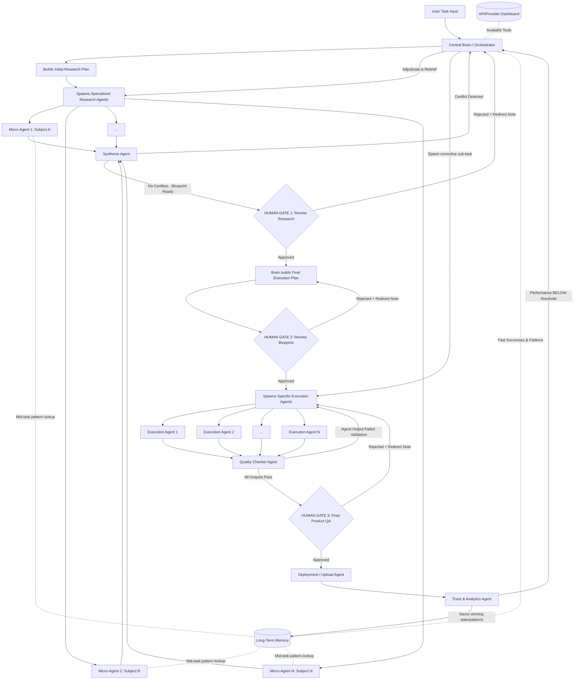

# Implementation Plan: Universal Autonomous Multi-Agent Architecture (Jarvis)

This document outlines the core operational architecture for Jarvis. It is designed to handle **any complex task** (marketing, coding, content creation, research) through a dynamic, multi-agent orchestration process.

## 1. Goal Description
To build a closed-loop, autonomous system where a Central Brain delegates tasks to highly specialized, dynamically spawned micro-agents. The system features two-stage planning (Research Plan -> Execution Plan), strict Human-in-the-Loop (HITL) approval gates with **rejection re-routing**, a conflict-resolving Synthesis Agent, a Quality Checker Agent, bidirectional Long-Term Memory, and a closed-loop performance feedback system.

---

## 2. Technical Safeguards

> [!TIP]
> **Modifications Added to the Core Script:**
>
> 1. **The Synthesis Mechanism:** If you spawn 12 research agents, they will return massive amounts of data. Passing all that raw data directly to the Execution Agents will overwhelm their context window. **Modification:** Added a `Synthesis Agent` right before Gate 1. It compresses the 12 reports into one hyper-dense blueprint. **⚠️ CRITICAL: "Compress" means an LLM reads ALL agent reports and produces a unified blueprint incorporating the best insights from each. It does NOT mean flattening dicts and picking the first value per key — that silently discards all but one agent's work.**
> 2. **API Fallback Loop:** APIs break or hit rate limits. **Modification:** If a specialized agent hits an error (e.g., YouTube API is down), it doesn't crash the system. It signals the Brain, which instantly reads the Dashboard and assigns a backup API (e.g., Supadata) to finish the job.
> 3. **[FIX #2] Gate Rejection Re-routing:** All three HITL Gates now have explicit rejection paths. A human "No" is never a dead end — it routes back with the rejection reason attached as context, so the Brain or Execution layer knows exactly what to correct.
> 4. **[FIX #3] Conflict Resolution in Synthesis:** The Synthesis Agent now detects contradictory findings between research agents before producing the blueprint. Conflicts are flagged and escalated back to the Brain to adjudicate, not silently discarded.
> 5. **[FIX #4] Quality Checker Agent:** After execution agents finish but before Gate 3 human review, a lightweight Quality Checker Agent validates each agent's output. Failed agents are re-spawned automatically rather than blocking the gate with bad output.
> 6. **[FIX #5] Bidirectional Long-Term Memory:** Research Agents can now query the Long-Term Memory mid-task, not just at initiation. This means a Hook Researcher can see that "punchy opening lines under 5 words historically perform 80% better" before writing, not after.
> 7. **[FIX #6] Closed-Loop Performance Feedback:** If the Track Agent detects performance below a defined threshold (e.g., video CTR < 3%), it sends a signal back to the Brain to re-initiate a corrective sub-task. The loop never ends at deployment.
> 8. **Max Retry / Loop Guard:** Configurable safeguards (`MAX_RETRIES = 3`) are applied to the conflict resolution loop, gate rejection re-routings, and Quality Checker re-runs. If retries exceed this limit, the system gracefully escalates to the user with a detailed error report containing the exact issues that caused the retries, preventing infinite loops and runaway LLM costs.

---

## 3. Proposed Architecture Flow (Fully Fixed)



---

## 4. Phase Breakdown

### Phase 1: The Central Brain (Orchestrator)
- **Action**: Receives the task, assesses difficulty, and determines the initial requirements.
- **Planning**: Creates an **Initial Implementation Plan** that strictly defines the research flow. It doesn't assume it knows how to execute yet.
- **Provisioning**: Reads the API/Provider configuration registry (mapping services to their API keys, endpoints, and status: up/down/rate-limited) and grants the necessary tools to the agents.
- **Memory Read**: Queries Long-Term Memory for any relevant past patterns *before* spawning agents.

### Phase 2: Parallel Micro-Research Agents
- **Action**: The Brain spawns highly specialized micro-agents to understand *how* to do the task perfectly.
- **Example (Video)**: `Hook Researcher`, `Body Researcher`, `CTA Researcher`, `SEO Researcher`, `Comment Researcher`.
- **Example (Coding)**: `Architecture Researcher`, `Dependency Researcher`, `Security Researcher`.
- **[FIX #5] Bidirectional Memory**: Each Research Agent can issue a memory query mid-task (e.g., "What hook formats worked above 70% retention?") and get back relevant patterns from past successful runs.
- **API Selection & Dynamic Tools**: Agents do NOT hardcode their tools list (e.g., in `research_agent.py`'s `tools_list`). Instead, they dynamically construct their tools list by reading the `tools_needed` provided in their configuration from the registry.
- **API Fallback Loop**: If an agent hits an API failure (e.g., rate limits or service down), it signals the Central Brain, which reads the registry status and reassigns a backup tool/connector to allow the agent to finish the task without crashing the pipeline.

### Phase 3: Synthesis Agent + Conflict Resolution [FIX #3]
- **Compression**: Synthesis Agent compresses all N parallel research reports into one hyper-dense blueprint.
  > **⚠️ ANTI-PATTERN WARNING:** "Compress" must NOT be implemented as naive dict-merging or picking one agent's value per key. The Synthesis Agent must use a structured LLM call that reads ALL N agent reports in full and produces a single unified blueprint that incorporates the best insights from each agent. Any implementation that flattens results into `{key: entries[0]["value"]}` silently discards all but one agent's findings and defeats the purpose of parallel research.
- **[FIX #3] Conflict Detection & Choice Resolution**: Before generating the blueprint, the Synthesis Agent checks for contradictions across agent reports (e.g., one agent says "use TikTok API", another says "TikTok API is down"), as well as competing tool/API recommendations. 
  - If a conflict or multiple competing options (APIs/MCPs) are detected:
    - They are formatted into a structured list of options.
    - Each option must explicitly show **"Why use it (Pros)"** and **"Why not use it (Cons)"**.
    - The signal and options route back to the Brain and are presented directly to the user at Gate 1.
    - **User Resolution**: The user is presented with a checkbox interface where they can see the comparison and select one or *multiple* APIs/MCPs/options to be used simultaneously.
  - Conflicts are flagged with the specific contradiction described.
  - The signal routes back to the Brain, not to the gate.
  - Brain adjudicates (either resolves it or re-spawns only the conflicting agents with corrected briefings).
  > **⚠️ ANTI-PATTERN WARNING:** Conflict detection must NOT compare stringified dict values across agents for matching keys. Research agents produce unique `findings` dicts with different keys — they will almost never share keys, so real semantic contradictions (e.g., Agent A says "use React" while Agent B says "React is not suitable for this use case") will be silently missed. Conflict detection must be performed by an LLM that reads all findings and identifies logical/semantic contradictions.
- **Gate 1**: The system pauses. The user reviews the aggregated research, the compiled blueprint, and any unresolved options/conflicts (allowing them to multi-select tools/APIs with pros/cons), and approves or redirects.

### Phase 4: HUMAN GATE 1 [FIX #2]
- **Approved**: Brain proceeds to build the Final Execution Plan.
- **[FIX #2] Rejected**: The user attaches a redirect note (e.g., "Focus more on competitor SEO analysis, not just ours"). This note is passed back to the Brain as additional context. The Brain **does not restart from scratch** — it re-briefs only the relevant research agents and re-synthesises.
  > **⚠️ ANTI-PATTERN WARNING:** "Re-briefs only the relevant research agents" must NOT be implemented as re-running ALL agents. The Brain must parse the redirect note to identify which specific agent(s) need re-briefing, then spawn only those. After they return, the Synthesis Agent must re-run using the mix of old (unchanged) + new (re-run) agent results — not discard the old results.

### Phase 5: Second Implementation Plan (Execution Blueprint)
- **Action**: Using the approved research, the Brain creates the **Final Implementation Plan**.
- **Dynamic Spawning**: The system spawns execution agents based *strictly* on what the research dictated was necessary.

### Phase 6: HUMAN GATE 2 [FIX #2]
- **Approved**: Execution agents are spawned and begin building.
- **[FIX #2] Rejected**: The redirect note routes back to the Second Implementation Plan stage. The Brain adjusts the blueprint (e.g., "swap out the Python backend for Node.js") without restarting research.

### Phase 7: Execution + Quality Checker [FIX #4]
- **Execution**: Spawned agents build the final product using their designated APIs.
- **[FIX #4] Quality Checker Agent**: Once all execution agents return their outputs, the Quality Checker Agent executes a **two-tiered verification**:
  1. **Individual Verification**: Runs schema checks (correct JSON keys, word count metrics) and executes a lightweight LLM call to verify that each agent's output semantically adheres to its individual brief, spec, and tone.
  2. **Global Integration Verification**: Executes a final LLM-powered check to ensure that all generated outputs align and integrate seamlessly with each other (and with any untouched components during partial re-runs).
- **Pass**: All outputs proceed to Gate 3.
- **Fail**: The specific failed agent(s) are flagged and re-spawned, not the entire execution batch.

### Phase 8: HUMAN GATE 3 [FIX #2]
- **Approved**: Deployment Agent authenticates and pushes the product live.
- **[FIX #2] Rejected**: The redirect note routes back to SpawnExec. Only the specific component the user rejected needs to be rebuilt, not the entire execution batch.
  > **⚠️ ANTI-PATTERN WARNING:** "Only the specific component" must NOT be implemented as re-running `run_execution_phase()` with the full agent plan (which re-spawns ALL agents). The redirect note must be parsed (by the Brain via LLM) to identify which specific agent ID(s) produced the rejected component, then only those agents are re-spawned. The final result set must merge the re-run outputs with the previously-approved outputs.

### Phase 9: Deployment Agent
- **Action**: An `agents/deployment_agent.py` is called by the pipeline coordinator once Gate 3 passes.
- **Mechanism**: The agent takes the final compiled execution results + a target platform configuration, authenticates with the external API/service (YouTube, GitHub, Stripe, etc.), and performs the actual upload/deployment.
- > **⚠️ ANTI-PATTERN WARNING:** The pipeline must NOT end prematurely by simply returning a dictionary with `"ready_for_deploy": True` (as currently done in `multi_agent_coordinator.py`). The coordinator must await the actual execution of the Deployment Agent and record the deployment status/logs in the pipeline state before passing control to the Track Agent.

### Phase 10: Closed-Loop Tracking [FIX #6]
- **Action**: An active `agents/track_agent.py` runs as a background process (or cron loop) to monitor live stats post-deployment.
- **Mechanism**: The agent actively polls external APIs (such as YouTube Analytics, Google Analytics, GitHub API, etc.) for performance data rather than relying on passive REST endpoints. It reads performance targets and thresholds directly from the task/pipeline metadata.
- **[FIX #6] Memory Save (Wins)**: If performance is ABOVE threshold — extracts the *why* (e.g., "This intro hooked 80% of viewers") and saves the pattern into Long-Term Memory.
  > **⚠️ ANTI-PATTERN WARNING:** "Extracts the *why*" must NOT be a simple copy of the metric value into the `memory_patterns` table (e.g., just saving `{"pattern": "ctr was 8%"}`). The Track Agent must use an LLM call that receives the full execution blueprint + the performance data and produces an actionable insight (e.g., "Opening with a question under 5 words correlated with 80% 30-second retention"). Raw metrics without causal analysis are useless as memory patterns.
- **[FIX #6] Corrective Loop (Losses)**: If performance is BELOW a defined threshold (e.g., CTR < 3%, error rate > 5%):
  - Track Agent sends a failure signal back to the Brain.
  - Brain spawns a **corrective sub-task** (e.g., "Re-cut the hook", "Patch the failing endpoint").
  - This sub-task re-enters the pipeline at Phase 7 (Execution), bypassing the research phase.
  - The loop is genuinely closed — deployment is not the end state.

---

## 5. What You Already Have vs. What You Need to Build

### ✅ Already Built
| Component | File | Status |
|---|---|---|
| Central Brain (single-agent) | `coordinator.py` | Working — needs multi-agent upgrade |
| Tool calling (DB, search) | `coordinator.py` | Working |
| Long-Term Memory (tasks + notes) | `db.py` | Working — needs pattern storage table |
| Flask API server | `jarvis.py` | Working |
| Wake word + voice | `jarvis.py` | Working |
| Brain Interface UI | `agent_map_final.html` | Working (Three.js nebula) |
| Pipeline Coordinator UI | `jarvis_plan_preview.html` | Prototype — needs backend wiring |
| API/MCP Connectors (stubs) | `connectors/` | Stubs only — need real implementations |

### 🔧 What Needs to Be Built

**Priority 1 — Core Multi-Agent Engine** (`multi_agent_coordinator.py`)
- Spawns N sub-agents as parallel async tasks (using `asyncio` + Gemini/Claude calls)
- Each sub-agent gets a scoped system prompt, specific tools, and a memory query hook
- Returns structured JSON results back to Brain

**Priority 2 — Synthesis Agent** (rewrite of `agents/synthesis.py`)
- **Action**: Converts the naive dictionary key merging to a structured Gemini model execution.
- **LLM Conflict Detection**:
  - Input: Raw list of findings from all N research agents.
  - Call: A Gemini call (with `response_mime_type="application/json"`) prompting the model to identify semantic and logical contradictions across reports (e.g., conflicting API recommendations, tool availability mismatches).
  - Output: Returns a JSON object with schema `{"has_conflicts": boolean, "conflicts": [{"description": "...", "agents_involved": [...], "options": [{"name": "...", "pros": "...", "cons": "..."}]}]}`.
- **LLM Blueprint Compression**:
  - Input: Raw findings from all N research agents.
  - Call: A Gemini call instructing the model to synthesize the N reports, resolving overlapping concepts and keeping only unique, complementary, high-value strategy details.
  - Output: Returns a single, hyper-dense JSON dictionary mapping the synthesized blueprint keys (without arbitrarily discarding any agent's unique contributions).

**Priority 3 — Quality Checker Agent** (new function in coordinator)
- Implements two-tiered check:
  1. Individual validation: Schema checks + a lightweight LLM call to verify that each agent's output semantically adheres to its individual brief, spec, and tone.
  2. Integration validation: An LLM-powered check to ensure that all generated outputs align and integrate seamlessly with each other (and with untouched components during partial re-runs).
- Returns pass/fail per agent with a reason string.

**Priority 4 — Memory Pattern Table** (add to `db.py`)
- New `memory_patterns` table: `pattern_text`, `outcome_metric`, `metric_value`, `task_type`, `created_at`
- Research Agents query this table mid-task via a `search_memory_patterns(query)` tool
- Track Agent writes to it post-deployment

**Priority 5 — HITL Gate API Endpoints** (add to `jarvis.py`)
- `POST /gate/approve` — advances pipeline to next phase
- `POST /gate/reject` — sends redirect note back to Brain, re-routes pipeline
- `GET /gate/status` — returns current gate the pipeline is paused at

**Priority 6 — UI Wiring** (`jarvis_plan_preview.html`)
- The Approve/Reject buttons already exist in the UI
- Wire them to the Flask `/gate/approve` and `/gate/reject` endpoints via `fetch()`
- The pipeline status columns should poll `/gate/status` to show which stage is active

**Priority 7 — Track Agent + Feedback Loop** (new `agents/track_agent.py`)
- A background thread (or cron) that polls deployment metrics (YouTube API, GA, etc.)
- Compares against threshold stored in task metadata
- Calls Brain's `handle_corrective_request()` if below threshold and saves winning patterns to `memory_patterns`.

**Priority 8 — Agent Monitor Dashboard** (new UI panel in `command_center.html` or dedicated page)
- Real-time observability layer with Agent Inspector, View Actions, and View Interactions.

**Priority 9 — Deployment Agent** (new `agents/deployment_agent.py`)
- Take final execution results + target platform config and perform actual deployment (API uploads, Git push, etc.).

**Priority 10 — API/Provider Dashboard & Connectors**
- Create configuration registry for service APIs (keys, endpoints, status).
- Enable dynamic tool construction in agents based on the Brain's plan rather than hardcoded lists.
- Implement API Fallback loop triggers.

**Priority 11 — Partial Re-Execution Logic** (in `multi_agent_coordinator.py`)
- Modify `run_execution_phase` to accept an optional `agent_ids_to_run: list[str] = None` list. If provided, the coordinator filters the tasks and spawns only the matching execution agent configurations.
- In the Gate 3 rejection branch of `run_full_pipeline`:
  1. Call a lightweight LLM checker to analyze the `redirect_note` against the active execution agent list and output the IDs of the agents that need to be re-run.
  2. Invoke `run_execution_phase`, passing the target `agent_ids_to_run` and the `redirect_note`.
  3. Merge the new outputs with the previously approved outputs from other agents (by replacing old items in `exec_results` that match `agent_id`).
  4. Run both individual validation and global integration validation (Quality Checker) on the newly merged results before returning to the Gate 3 state.

**Priority 12 — Max Retry & Loop Guards** (in `multi_agent_coordinator.py`)
- Implement a configurable `MAX_RETRIES` (default `3`) limit trackable state counters in the pipeline loops.
- Track retry numbers for conflict resolution loops, gate rejections, and QA re-runs.
- If the limit is reached, break the loop and return an error escalation structure (e.g. `{"status": "escalated_to_human", "message": "Failed after 3 retries. Error details: ..."}`) instead of continuing to loop.

The pipeline needs a real-time observability layer so you can see exactly what every agent is doing, what they're saying to the Brain, and inspect any individual agent's plan/output at any time. This consists of three views accessible from a shared toolbar:

#### 8a. Agent Inspector (Dropdown Selector)
- A **dropdown / select box** listing every agent currently spawned or previously run in the active pipeline, grouped by phase:
  ```
  ── Research Agents ──
  agent_research_1 — Hook Researcher [✅ done]
  agent_research_2 — SEO Researcher [⏳ running]
  agent_research_3 — CTA Researcher [❌ error]
  ── Execution Agents ──
  agent_exec_1 — Script Writer [⏳ running]
  agent_exec_2 — Thumbnail Designer [🕐 queued]
  ── System Agents ──
  Synthesis Agent [✅ done]
  Quality Checker [🕐 queued]
  ```
- When you **select an agent** from the dropdown, a detail panel shows:
  - **Agent Config**: role, brief, tools_needed, memory_query
  - **Status**: queued / running / done / error
  - **Input**: The system prompt and context it was given (including memory patterns injected)
  - **Output**: The full JSON result it returned (findings, confidence, sources, recommendation)
  - **Duration**: How long it ran (start time → end time)
  - **Error details**: If status is `error`, the full exception/traceback

#### 8b. View Actions (Button)
- A **"View Actions"** button next to the dropdown opens a **live activity feed** showing what every agent and system component is doing right now, in chronological order:
  ```
  [10:05:12] Brain → Built research plan (6 agents)
  [10:05:13] agent_research_1 (Hook Researcher) → Spawned
  [10:05:13] agent_research_2 (SEO Researcher) → Spawned
  [10:05:13] agent_research_3 (CTA Researcher) → Spawned
  [10:05:18] agent_research_1 → Queried memory: "hook formats high retention"
  [10:05:22] agent_research_1 → Completed (confidence: 0.87)
  [10:05:25] agent_research_3 → ERROR: Google Search API rate limited
  [10:05:26] Brain → Re-spawning agent_research_3 with fallback tools
  [10:05:30] agent_research_2 → Completed (confidence: 0.91)
  [10:05:35] agent_research_3 → Completed (confidence: 0.74)
  [10:05:36] Synthesis Agent → Running conflict detection...
  [10:05:38] Synthesis Agent → No conflicts. Blueprint ready.
  [10:05:38] GATE 1 → Waiting for human approval
  ```
- Each entry is color-coded: 🟢 success, 🟡 in-progress, 🔴 error, 🔵 system/gate
- Auto-scrolls to latest, with a "pin" toggle to freeze scrolling

#### 8c. View Interactions (Button)
- A **"View Interactions"** button opens a **full communication log** showing every message passed between agents, the Brain, and the system — formatted like a chat transcript:
  ```
  ┌─────────────────────────────────────────┐
  │ Brain → agent_research_1                │
  │ SYSTEM PROMPT: You are a Hook           │
  │ Researcher agent...                     │
  │ BRIEF: Research the best hook formats   │
  │ for YouTube videos about AI tools...    │
  │ MEMORY CONTEXT: [3 patterns injected]   │
  ├─────────────────────────────────────────┤
  │ agent_research_1 → Brain                │
  │ {                                       │
  │   "agent_id": "agent_research_1",       │
  │   "confidence": 0.87,                   │
  │   "findings": { ... },                  │
  │   "recommendation": "Use question-      │
  │   based hooks under 5 words"            │
  │ }                                       │
  ├─────────────────────────────────────────┤
  │ Synthesis Agent → Brain                 │
  │ CONFLICT: agent_research_2 says "use    │
  │ TikTok API" but agent_research_4 says   │
  │ "TikTok API is rate-limited"            │
  ├─────────────────────────────────────────┤
  │ Brain → agent_research_2               │
  │ RE-BRIEF: TikTok API confirmed down.   │
  │ Switch to Supadata fallback...          │
  └─────────────────────────────────────────┘
  ```
- Filterable by: agent ID, direction (inbound/outbound), phase, message type (prompt / result / conflict / gate decision)
- Expandable JSON blocks (collapsed by default for large outputs)

#### Backend Requirements
The following data structures and endpoints are needed to power the dashboard:

**In-memory event log** (add to `jarvis.py`):
- `AGENT_EVENT_LOG: list[dict]` — append-only log of all agent lifecycle events
- Each event: `{"timestamp", "source", "target", "event_type", "phase", "data"}`
- Event types: `spawned`, `running`, `completed`, `error`, `memory_query`, `conflict`, `gate_waiting`, `gate_resolved`, `re-spawned`

**Agent registry** (add to `jarvis.py`):
- `AGENT_REGISTRY: dict[str, dict]` — maps agent_id to its full config + current status + output
- Updated by the multi_agent_coordinator as agents are spawned and complete

**New API endpoints** (add to `jarvis.py`):
- `GET /agents` — returns the full agent registry (all agents, their configs, status, outputs)
- `GET /agents/<agent_id>` — returns a single agent's full detail
- `GET /agents/events` — returns the event log (supports `?since=<timestamp>` for polling)
- `GET /agents/interactions` — returns the interaction log (all prompts sent and results received)

---


## 6. What is Missing From This Plan

> [!IMPORTANT]
> **Audit methodology:** Every claim below was cross-referenced against the actual codebase files. Items previously listed as "missing" that already exist in code have been corrected.

---