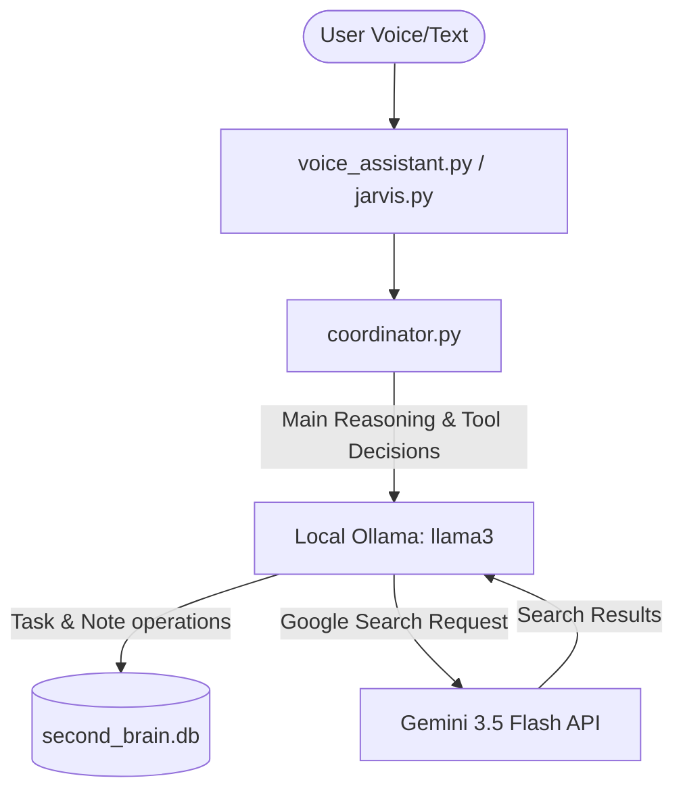

# Jarvis Local LLM Brain Implementation Plan

This plan details how to modify Jarvis to run with a local LLM (via **Ollama**) as its primary brain, while outsourcing web search queries to **Google Gemini** using the Gemini API.

## Architecture Overview



1. **Primary Brain (Ollama)**: When you speak a request, the transcribed text is sent to your local Ollama instance running `qwen2.5:3b`. It is configured to run the main logic and decide which tool to use.
2. **Local Tools**: Ollama executes database operations (add note, complete task, list tasks) on your local SQLite database.
3. **Outsourced Search (Gemini)**: If Ollama needs real-time information (e.g., "What is the weather?" or "Search for the latest news"), it triggers a tool that sends the query to the Gemini API (which has high-quality Google Search integration). The result is returned to Ollama to formulate the final spoken response.

## Proposed Changes

### Dependencies

#### [MODIFY] [requirements.txt](file:///d:/Charalambos/Desktop/AI/second-brain-voice/requirements.txt)
Add `openai` to `requirements.txt` to connect to Ollama's OpenAI-compatible API endpoint.

### Configuration

#### [MODIFY] [settings.json](file:///d:/Charalambos/Desktop/AI/second-brain-voice/settings.json)
Add model configuration settings:
```json
{
  "theme": "obsidian",
  "voice_speed": 200,
  "wake_word_threshold": 0.9,
  "ollama_url": "http://127.0.0.1:11434",
  "ollama_model": "qwen2.5:3b"
}
```

#### [MODIFY] [.env](file:///d:/Charalambos/Desktop/AI/second-brain-voice/.env)
Keep `GEMINI_API_KEY` for the Google Search outsourcing tool.

### Core Implementation

#### [MODIFY] [coordinator.py](file:///d:/Charalambos/Desktop/AI/second-brain-voice/coordinator.py)
1. **Initialize Ollama Client**: Configure a connection to the local Ollama instance (defaulting to `http://127.0.0.1:11434`).
2. **Add GPU-to-CPU Fallback Startup**: Implement `ensure_ollama_running(url, model, force_cpu)` to automatically check/spawn Ollama on GPU, verifying model load, and cleanly falling back to CPU if it crashes or fails.
3. **Define Google Search Tool**: Implement a python function `outsource_google_search(query: str) -> str` that makes a simple call to Gemini with search grounding enabled, returning the search results.
4. **Orchestrate Chat Loop**:
   - Reconstruct the conversation context for the Ollama chat endpoint.
   - Teach the local LLM how to invoke tools.
   - When the LLM decides to call `google_search`, execute the Gemini-based search and return the text back to the LLM.
   - When the LLM calls db-related tools (like `add_task`), execute them and return the results.

---

## Verification Plan

### Automated/Local Tests
- Run validation queries to ensure Ollama connects successfully, tools run, and Gemini grounding behaves correctly.

### Manual Verification
1. Start Jarvis: `python voice_assistant.py` or `python jarvis.py`.
2. Say *"Hey Jarvis, what is my task list?"* (Verify it accesses the local database).
3. Say *"Hey Jarvis, search the web for the latest updates on space missions."* (Verify it calls Gemini to get search results, and then the local model reads the final answer).
